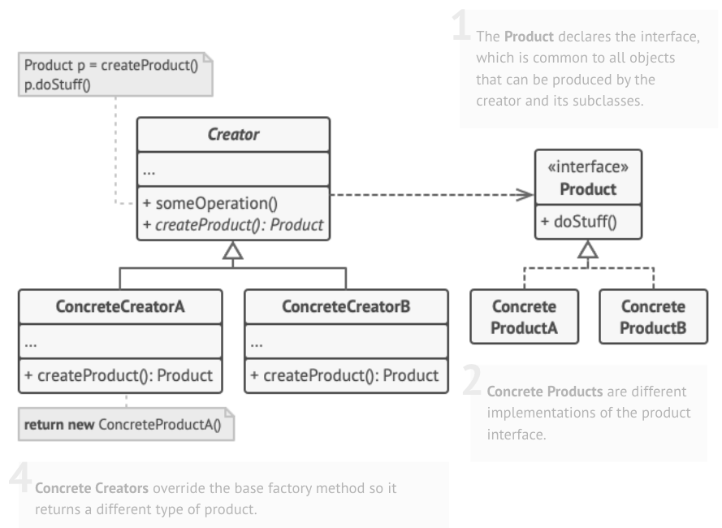
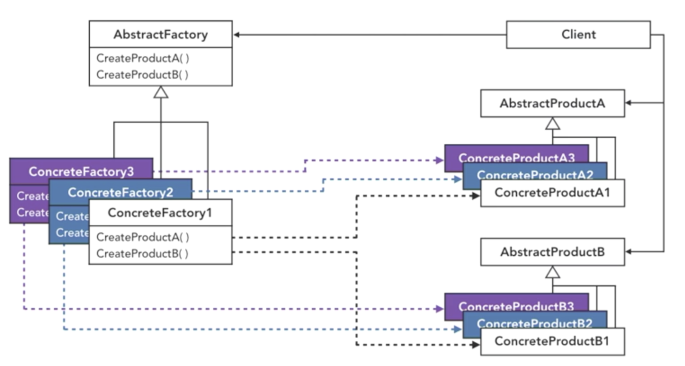
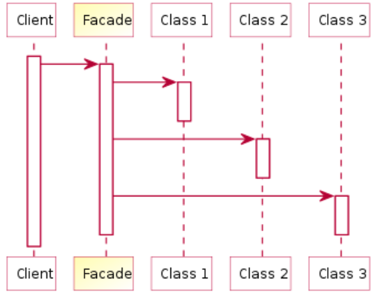
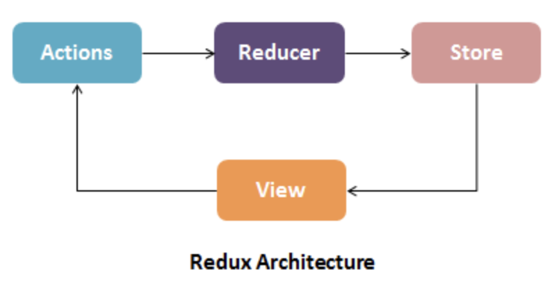

# Design Pattern


> Term

* God object: an object that knows too much or does too much
  * [-] Changes made to object for benefit of one routine can have unintended effects on other unrelated routines
  * [+] tight programming where performance increase and centralization of control are more important than maintaining
  * [ex] microcontrollers
* Lasagna: code with complicated layers, intertwined that making change in layer necessitate changes in other layers
* Ravioli: comprises well-structured, easy classes in isolation, but difficult to understand as a whole

> Reference

* [Design Pattern](https://refactoring.guru/design-patterns)

## Creational


* Used to create objects in a systematic way
* Polymorphism is widely used
* Creation classes can't be OCP but let other classes be OCP and SRP
* Creating an object requires naming a concrete class
* Creating a complex object is a unique responsibility
* Dependency inversion principle
* Defines an interface for creating an object that defer instantiation to subclasses
* User expectation yields multiple, related objects
* [+] Flexibility → Different subtypes of objects from same class at runtime

| Type     | Description                                                                            |
| -------- | -------------------------------------------------------------------------------------- |
| Borg     | subclass have the same state as their parents classes objects                          |
| Singlton | subclass of the singleton has its own state / objects are the same, not just the state |

### Borg




```py
class Borg:
  _shared_state = {}
  def __init__(self):
    self.__dict__ = self._shared_state

class Singleton(Borg):
  def __init__(self, **kwargs):
    Borg.__init__(self)
  def__str__(self):

Singleton(HTTP = "Hypertext Transfer Protocol")
Singleton(SNMP = "Simple Network Management Protocol") # {HTTP: "Hyp…,", SNMP: "SIM…"}
```




### Builder


* Separate the construction of a complex object from its representation
* same construction process can create different representations




```java
// 1. House builder
interface HousePlan {
  public void setRoof(String roof);
  public void setInterior(String interior);
}
class House implements HousePlan {
  private String roof, interior;
  public void setRoof(String roof) { this.roof = roof; }
  public void setInterior(String interior) { this.interior = interior; }
}
interface HouseBuilder {
  public void bulidRoof();
  public void buildInterior();
  public House getHouse();
}
class IglooHouseBuilder implements HouseBuilder {
  private House house;
  public IglooHouseBuilder() { this.house = new House(); }
  public void buildInterior() { house.setInterior("Ice Carvings"); }
  public void bulidRoof() { house.setRoof("Ice Dome"); }
  public House getHouse() { return this.house; }
}
class TipiHouseBuilder implements HouseBuilder {
  private House house;
  public TipiHouseBuilder() { this.house = new House(); }
  public void buildInterior() { house.setInterior("Fire Wood"); }
  public void bulidRoof() { house.setRoof("Wood, caribou and seal skins"); }
  public House getHouse() { return this.house; }
}

class CivilEngineer  {
  private HouseBuilder houseBuilder;
  public CivilEngineer(HouseBuilder houseBuilder) { this.houseBuilder = houseBuilder; }
  public House getHouse() { return this.houseBuilder.getHouse(); }
  public void constructHouse() {
    this.houseBuilder.bulidRoof();
    this.houseBuilder.buildInterior();
  }
}

class Builder {
  public static void main(String[] args) {
    HouseBuilder iglooBuilder = new IglooHouseBuilder();
    CivilEngineer engineer = new CivilEngineer(iglooBuilder);
    engineer.constructHouse();
    House house = engineer.getHouse();
    System.out.println("Builder constructed: "+ house);
  }
}
```




### Factory

* Provides an interface for creating object in a superclass, but allows subclasses to alter the type of objects
* If all product classes implement a common interface, pass their objects to client code without breaking it
* Follow Single Repsonsibility, Open/Closed Principle
* [ex] Adding Ship logic in Truck delivery app
* [+] when you don’t know beforehand exact types and dependencies of objects
* [+] provide users of your library or framework with a way to extend its internal components ([ex] customize button)
* [+] save system resources by reusing existing objects instead of rebuilding ([ex] database connections, file system)
* [-] more complicated since you need to introduce a lot of new subclasses to implement the pattern



> Term

* Creator: declares the factory method that returns new product objects
  * Product creation is not the primary responsibility of the creator ([ex] large company can have training department)
  * Also has some core business logic related to products
* Product: Objects returned by a factory method




```cpp
#include <iostream>
#include <string>

using namespace std;

// 1. Coffee Factory
class Coffee {
  protected:
    string _type;

  public:
    Coffee(string type) : _type(type) {}
    string getType() { return _type; }
};

class Espresso : public Coffee {
  public:
    Espresso() : Coffee("Espresso") { cout << endl << "Making a cup of espresso" << endl; }
};

class Cappuccino : public Coffee {
  public:
    Cappuccino() : Coffee("Cappuccino") { cout << endl << "Making a cup of cappuccino." << endl; }
};

class CoffeeMakerFactory {
  private:
    Coffee* _coffee;
  public:
    Coffee* GetCoffee() {
      int choice;

      cout << "Select type of coffee to make: " << endl;
      cout << "1: Espresso" << endl;
      cout << "2: Cappuccino" << endl;
      cout << "Selection: " << endl;
      cin >> choice;

      switch (choice) {
        case 1: return new Espresso;
        case 2: return new Cappuccino;
        default:
          cout << "Invalid Selection" << endl;
          return NULL;
      }
    }
};

int main() {
  CoffeeMakerFactory coffeeMachine;
  Coffee* cup;
  cup = coffeeMachine.GetCoffee();
  cout << endl << "Ordered " << cup->getType() << endl;
}
```




```java
Event event = new Event(2, "OrderFlowers");   // BAD
Event event  = Event.makeOrderFlowers();      // BETTER
Event event = factory.createEvent(FLOWERS);   // BEST
```




```py
import json
import xml.etree.ElementTree as et

# 1. Simple factory
def get_pet(pet):
  pets=dict(dog=Dog("Bosom"), cat=Cat("Neo"))
  return gets[pet]

# 2. Serializer
class SerializerFactory:
  def __init__(self):
    self._creators = {}

  def register_format(self, format, creator):
    self._creators[format] = creator

  def get_serializer(self, format):
    creator = self._creators.get(format)
    if not creator:
      raise ValueError(format)
    return creator()


class ObjectSerializer:
  def serialize(self, serializable, format):
    serializer = factory.get_serializer(format)
    serializable.serialize(serializer)
    return serializer.to_str()


class JsonSerializer:
  def __init__(self):
    self._current_object = None

  def start_object(self, object_name, object_id):
    self._current_object = { 'id': object_id }

  def add_property(self, name, value):
    self._current_object[name] = value

  def to_str(self):
    return json.dumps(self._current_object)


class XmlSerializer:
  def __init__(self):
    self._element = None

  def start_object(self, object_name, object_id):
    self._element = et.Element(object_name, attrib={'id': object_id})

  def add_property(self, name, value):
    prop = et.SubElement(self._element, name)
    prop.text = value

  def to_str(self):
    return et.tostring(self._element, encoding='unicode')


class Song:
  def __init__(self, song_id, title, artist):
    self.song_id = song_id
    self.title = title
    self.artist = artist

  def serialize(self, serializer):
    serializer.start_object('song', self.song_id)
    serializer.add_property('title', self.title)
    serializer.add_property('artist', self.artist)

if __name__ == "__main__":
  factory = SerializerFactory()
  factory.register_format('JSON', JsonSerializer)
  factory.register_format('XML', XmlSerializer)

  json_serial = factory.get_serializer("JSON")

  song = Song('1', 'Water of Love', 'Dire Straits')
  serializer = ObjectSerializer()

  print(serializer.serialize(song, 'JSON'))
  print(serializer.serialize(song, 'XML'))
```




### Abstract Factory

* used for factory of factories → UI Theme / Car






```cpp
#include <iostream>
#include <string>

using namespace std;

class Door {
  public:
    Door() {}
    virtual void Open() = 0;
};

class GasCarDoor : public Door {
  public:
    GasCarDoor() {}
    void Open() { cout << "click" << endl; }
};

class ElectricCarDoor : public Door {
  public:
    ElectricCarDoor() {}
    void Open() { cout << "shhhhh" << endl; }
};

class Engine {
  protected:
    string _sound;

  public:
    Engine(string sound) : _sound(sound) {}
    virtual void Run() = 0;
};

class GasEngine : public Engine {
   public:
    GasEngine() : Engine("vroom") {}
    void Run() { cout << _sound << endl; }
};

class ElectricEngine : public Engine {
   public:
    ElectricEngine() : Engine("shh") {}
    void Run() { cout << _sound << endl; }
};

class CarFactory {
   public:
    virtual Door* BuildDoor() = 0;
    virtual Engine* BuildEngine() = 0;
};

class GasCarFactory : public CarFactory {
   public:
    Door* BuildDoor() { return new GasCarDoor(); }
    Engine* BuildEngine() { return new GasEngine(); }
};

class ElectricCarFactory : public CarFactory {
   public:
    Door* BuildDoor() { return new ElectricCarDoor(); }
    Engine* BuildEngine() { return new ElectricEngine(); }
};

int main() {
  CarFactory* CarPlant;
  int choice;

  cout << "Select a car type: " << endl;
  cout << "1: Gasoline" << endl;
  cout << "2: Electric" << endl;
  cout << "Selection: ";
  cin >> choice;
  cout << endl;

  switch (choice) {
    case 1:
      CarPlant = new GasCarFactory;
      break;
    case 2:
      CarPlant = new ElectricCarFactory;
      break;
  }

  Door* myDoor = CarPlant->BuildDoor();
  Engine* myEngine = CarPlant->BuildEngine();
  myDoor->Open();
  myEngine->Run();
}
```




### Singleton

* subclass of the singleton has its own state
* objects are the same, not just the state
* External hardware resource usage limitation required
* Log files generation / Cache
* Performance benefit as it prevents multiple users to repeatedly access and read the configuration file
* Borg subclass of the singleton pattern has its own state and therefore will produce different objects




```java
class Singleton {
  static private Singleton instance;
  private Singleton() {}
  public static Singleton getInstance() {
    if (instance == null) instance = new Singleton();
    return instance;
  }
}
```




```py
# 1. Class
class Singleton(object):
  _instance = None
  def __new__(class_, *args, **kwargs):
  if not isinstance(class_._instance, class_):
    class_._instance = object.__new__(class_, *args, **kwargs)
  return class_._instance

# 2. decorater (Used with @singleton)
def singleton(cls):
  instances = {}
  def getinstance():
    if cls not in instances:
    instances[cls] = cls()
    return instances[cls]
  return getinstance

# 3. Singleton Model in django
class Origin(models.Model):
  name = models.CharField(max_length=100)
  def save(self, *args, **kwargs):
    if self.__class__.objects.count():
      self.pk = self.__class__.objects.first().pk
    super().save(*args, **kwargs)
```




### RAII

* Resource acquisition is in initialization
* resource is acquired in constructor (optional) / relinquished in destructor (e.g. file io)
* Instances of the class are stack allocated
* shared_ptr is one example
* Resources (heap memory, file handles, sockets) should be owned by an object




```cpp
#include <fstream>
#include <iostream>
#include <sstream>
#include <string>
using namespace std;
class OpenFile {
 public:
  OpenFile(const char* filename) {
    // throws an exception on failure
    _file.open(filename);
  }

  ~OpenFile() { _file.close(); }

  string readLine() {
    string line;
    getline(_file, line);
    return line;
  }

 private:
  ifstream _file;
};
int main() {
  OpenFile f("Makefile");
  cout << f.readLine();
}
```




## Structural

* Establishes useful relationships between software components in configuration
* Inheritance

### Adaptor

* allows the interface of an existing class to be used as another interface
* Implement the interface your class expects
* Get a reference to the object that we are adapting
* Adaptor composite describes objects that treated same way as a single instance of same object type





```cpp
#include <iostream>
using namespace std;

class Int {
  int data;

 public:
  Int(int data) : data(data) {}
  Int(const Int &i) : data(i.data) {}
  operator int() { return data; }  // Use all default int operators
  friend ostream &operator<<(ostream &os, const Int &i) {
    return os << "data = " << i.data;  // can access private
  }
};
int main() {
  Int x = 3;
  int a = x + 4;

  x = a * 2 + x + 4;
  std::cout << x << std::endl;  // data = 21
}
```




```java
interface ITarget { void request(); }
class Adapter implements ITarget {         // Adapter class enables Adaptee to use incompatible Itarget
  Adaptee adaptee;
  public Adapter(Adaptee a) { this.adaptee = a; }
  public void request() { this.adaptee.specificRequest(); }
}
class Adaptee {  public void specificRequest() { ... } }

ITarget target = new Adapter( new Adaptee() );
target.request();
```




### Bridge

* about communication between separate objects




```py
import abc
import urllib.parse
import urllib.request


class ResourceContent:
  """ Maintain a reference to an object which represents the Implementor.  """
  def __init__(self, imp):
    self._imp = imp

  def show_content(self, path):
    self._imp.fetch(path)


class ResourceContentFetcher(metaclass=abc.ABCMeta):
  """ Define interface (Implementor) for implementation classes that help fetch content.  """
  @abc.abstractmethod
  def fetch(path):
    pass


class URLFetcher(ResourceContentFetcher):
  """ Implement the Implementor interface and define its concrete implementation. """
  def fetch(self, path):
    req = urllib.request.Request(path)
    with urllib.request.urlopen(req) as response:
      if response.code == 200:
        the_page = response.read()
        print(the_page)


class LocalFileFetcher(ResourceContentFetcher):
  """ Implement the Implementor interface and define its concrete implementation.  """
  def fetch(self, path):
    # path is the filepath to a text file
    with open(path) as f:
      print(f.read())


url_fetcher = URLFetcher()
iface = ResourceContent(url_fetcher)
iface.show_content('http://python.org')

print('===================')
localfs_fetcher = LocalFileFetcher()
iface = ResourceContent(localfs_fetcher)
iface.show_content('file.txt')
```




### Decorator

* SRP, allows functionality to be divided between classes with unique areas of concern
* [+] assign extra behaviors to objects at runtime without breaking the code that uses these objects
* [+] awkward or impossible to extend an object’s behavior using inheritance
* [-] hard to implement a decorator in such a way that its behavior doesn’t depend on the order in decorators stack
* [-] initial configuration code of layers might look pretty ugly, hard to remove a specific wrapper from wrappers stack





```java
interface Beverage { int cost(); }
interface AddonDecorator extends Beverage { int cost(); }
class Espresso implements Beverage {
  public int cost() { return 1; }
}
class Caramel implements AddonBeverage {
  Beverage beverage;
  public caramel(Beverage b) { this.beverage = b; }
  public int cost() { return this.beverage.cost() + 2; }
}
Beverage bev = new Foam(new Espresso());

// Generally simpler and better
interface Beverage {
  String getDescription();
  int cost();
}
class CoffeeDrink extends Beverage {
  float theCost;
  CoffeeDrink(String desc, float cost) { description = desc; theCost = cost;}
  float cost() { return theCost; }
}
class Condiment extends Beverage {
  Beverage beverage;
  float theCost;
  Condiment(Beverage bev, String desc, float cost) {
    beverage = bev; description = desc; theCost = cost; }
  float cost() { return beverage.cost() + theCost; }
  String getDescription() { return beverage.getDescription() + ", " + description; }
}

Beverage bev = new Condiment(new CoffeeDrink("Espresso", 1.00), "Foam", 0.3); // making is hard
```




* HOC: higher-order component is a function that takes a component and returns a new component
  * replacement of mixin as it introduces implicit dependencies and cause name clashes, complexity
  * [ex] CommentList, BlogPost

```js
// 1. Higher order component
function withSubscription(WrappedComponent, selectData) {  // This function takes a component.
  return class extends React.Component {  // returns another component.
    constructor(props) {
      super(props);
      this.handleChange = this.handleChange.bind(this);
      this.state = {
        data: selectData(DataSource, props)
      };
    }

    componentDidMount() {
      DataSource.addChangeListener(this.handleChange);  // ... that takes care of the subscription...
    }

    componentWillUnmount() {
      DataSource.removeChangeListener(this.handleChange);
    }

    handleChange() {
      this.setState({
        data: selectData(DataSource, this.props)
      });
    }

    render() {
      // renders the wrapped component with the fresh data! Notice that we pass through any additional props
      return <WrappedComponent data={this.state.data} {...this.props} />;
    }
  };
}
```




```py
# 1. Nested decorator, func = dec2(dec1(func))
@dec2
@dec1
def func(arg1, arg2, ...):
  pass

# 2. Multiple args, same as func = decomaker(argA, argB, ...)(func)
@decomaker(argA, argB, ...)
def func(arg1, arg2, ...):
  pass

# 3. Getter, Setter, Deleter
@property
def fullname(self):
  return f'{self.first} {self.last}'

@fullname.setter
def fullname(self, name):
  first, last = name.split(‘ ‘)
  self.first = first
  self.last = last

@fullname.deleter
def fullname(self):
  self.first = None
  self.last = None

class classmethod(object):    # classmethod
  def __init__(self, method):
    self.method = method
  def __get__(self, instance, cls):
    return lambda *args, **kw: self.method(cls, *args, **kw)
```




### Delegation

* allows object composition to achieve the same code reuse as inheritance
* an object handles a request by delegating to a second object (the delegate)
* The delegate is a helper object, but with the original context




```java
// delegate (receiving) object
class Rectangle(int width, int height) {
  void area() {
    return width * height;
  }
}

// original (sending) object
class Window(Rectangle bounds) {
  void area() {
    return bounds.area();
  }
}
```




### Facade

* [+] interface masking more complex underlying or structural code
* [-] facade can become a god object coupled to all classes of an app






```cpp
struct CPU {
  void Freeze();
  void Jump(long position);
  void Execute();
};

struct HardDrive {
  char* Read(long lba, int size);
};

struct Memory {
  void Load(long position, char* data);
};

class ComputerFacade {
 public:
  void Start() {
    cpu_.Freeze();
    memory_.Load(kBootAddress, hard_drive_.Read(kBootSector, kSectorSize));
    cpu_.Jump(kBootAddress);
    cpu_.Execute();
  }

 private:
  CPU cpu_;
  Memory memory_;
  HardDrive hard_drive_;
};

int main() {
  ComputerFacade computer;
  computer.Start();
}
```




```py
from __future__ import annotations


class Facade:
  """ The Facade class provides a simple interface to the complex logic of one or several subsystems.
  The Facade delegates the client requests to the appropriate objects within the subsystem.
  The Facade is also responsible for managing their lifecycle. All of this shields the client from the undesired
  complexity of the subsystem.  """

  def __init__(self, subsystem1: Subsystem1, subsystem2: Subsystem2) -> None:
    """ Depending on your application's needs, you can provide the Facade with
    existing subsystem objects or force the Facade to create them on its own. """
    self._subsystem1 = subsystem1 or Subsystem1()
    self._subsystem2 = subsystem2 or Subsystem2()

  def operation(self) -> str:
    """ The Facade's methods are convenient shortcuts to the sophisticated functionality of the subsystems.
    However, clients get only to a fraction of a subsystem's capabilities. """

    results = []
    results.append("Facade initializes subsystems:")
    results.append(self._subsystem1.operation1())
    results.append(self._subsystem2.operation1())
    results.append("Facade orders subsystems to perform the action:")
    results.append(self._subsystem1.operation_n())
    results.append(self._subsystem2.operation_z())
    return "\n".join(results)


class Subsystem1:
  """ The Subsystem can accept requests either from the facade or client directly.
  In any case, to the Subsystem, the Facade is yet another client, and it's not a part of the Subsystem.  """
  def operation1(self) -> str:
    return "Subsystem1: Ready!"

  def operation_n(self) -> str:
    return "Subsystem1: Go!"


class Subsystem2:
  """ Some facades can work with multiple subsystems at the same time.  """
  def operation1(self) -> str:
    return "Subsystem2: Get ready!"

  def operation_z(self) -> str:
    return "Subsystem2: Fire!"


def client_code(facade: Facade) -> None:
  """ The client code works with complex subsystems through a simple interface provided by the Facade.
  When a facade manages the lifecycle of the subsystem, the client might not even know about existence of the subsystem.
  This approach lets you keep the complexity under control.  """
  print(facade.operation(), end="")


if __name__ == "__main__":
  # client code may have some of the subsystem's objects already created.
  # In this case, it's worth to initialize Facade with these objects instead of letting Facade create new instances
  facade = Facade(Subsystem1(), Subsystem2())
  client_code(facade)

""" Execution result
Facade initializes subsystems:
Subsystem1: Ready!
Subsystem2: Get ready!
Facade orders subsystems to perform the action:
Subsystem1: Go!
Subsystem2: Fire! """
```




### Flyweight

* [+] Save lots of RAM, assuming your program has tons of similar objects.
* [-] Trading RAM over CPU cycles when some of context data needs to be recalculated each time somebody calls flyweight method
* [-] much complicated. New team members will always be wondering why the state of an entity was separated in such a way

> Reference

<https://refactoring.guru/design-patterns/flyweight>

### IOC

* Inversion of Control decouple business logic from implementation simplify maintenance
* inverts flow of control: custom-written portions of a computer program receive the flow of control from a generic framework




```py
import abc

# Entities level
class Entity(metaclass=abc.ABCMeta):
  @abc.abstractmethod
  def _lower_level_meth(self):
    raise NotImplementedError

  @property
  def entity_prop(self):
    return self._lower_level_meth()

# Adapters level
class ImplementedEntity(Entity):
  __private = 'private attribute value'

  def __init__(self, pub_attr):
    self.pub_attr = pub_attr

  def _lower_level_meth(self):
    print(f'{self.pub_attr}\n{self.__private}')

# Infrastructure level
if __name__ == '__main__':
  ENTITY = ImplementedEntity('public attribute value')
  ENTITY.entity_prop
```




### Mediator

* Simplifies maintenance of the system by centralizing control logic
* Commonly used to coordinate related GUI components
* [+] reduce coupling, SRP, OCP, reuse individual component easily
* [+] Increase the reusability of the objects supported by the mediator by decoupling them from the system
* [-] Over time a mediator can become overly complex and become a God Object





```cpp
#include <algorithm>
#include <iostream>
#include <set>
#include <sstream>
using namespace std;
// Without graph, it’s coupled and cannot be tested alone

class Nodes {
 public:
  set<int> nodes = set<int>();
  void addNode(int n) { nodes.insert(n); }
  void remNode(int n) { nodes.erase(n); }
  int size() { return nodes.size(); }
};
class Edges {
 public:
  set<pair<int, int>> edges;
  void addEdge(int n1, int n2) { edges.insert(std::make_pair(n1, n2)); }
  void remNode(int n) {
    for (set<pair<int, int>>::iterator itr = edges.begin(); itr != edges.end();) {
      if (itr->first == n || itr->second == n)
        edges.erase(itr++);
      else
        ++itr;
    }
  }
  int size() { return edges.size(); }
};
class Graph {
 public:
  Nodes nodes;
  Edges edges;
  void remNode(int n) {
    edges.remNode(n);
    nodes.remNode(n);
  }
  void addEdge(int n1, int n2) {
    nodes.addNode(n1);
    nodes.addNode(n2);
    edges.addEdge(n1, n2);
  }
  string info() {
    stringstream ss;
    ss << "# nodes" << nodes.size() << ", # edges" << edges.size();
    return ss.str();
  };
};

int main() {
  Graph g;
  g.addEdge(1, 2);
  g.addEdge(3, 2);
  cout << g.info() << endl;
  g.remNode(2);
  cout << g.info();
}
```




### Flux


* Store/ Stores: Serves as a container for the app state & logic
* Action: Enables data passing to the dispatcher
* View: Same as the view in MVC architecture, but in the context of React components
* Dispatcher: Coordinates actions & updates to stores

### Redux



* Reducer: Logic that decides how your data changes exist in pure functions
  * updates the centralized store with new data based on the kind of action it receives
* Centralized store: Holds a state object that denotes the state of the entire app

### Proxy


* server that acts on behalf of a client in order to access another service
* Not implementation → exist in many layers
* intermediary for requests from clients seeking resources from servers that provide those resources
* [+] caching (the cache can be public or private, like the browser cache)
* [+] filtering (like an antivirus scan or parental controls)
* [+] load balancing (to allow multiple servers to serve the different requests)
* [+] authentication (to control access to different resources)
* [+] logging (allowing the storage of historical information)
* [-] Complicated by introducing more classes, the response from the service might get delayed.

> Term

* Web proxy: Reduce web traffic by caching web data / Deny malign websites → old technologies
* reverse proxy: appear to be a single server to external clients, but actually represents many servers living behind it
  * load balancing / decryption
  
* VPN: Allow for the extension of a private or local network to hosts that might not be on that local network
  * transport payload section to carry encrypted payload that actually contains an entire second set of packets
  * requires strict authentication procedures to ensure they connected to by authorized users
  




* class functioning as an interface to something else

```py
class Image:
  def __init__(self, filename):
    self._filename = filename

  def load_image_from_disk(self):
    print("loading " + self._filename)

  def display_image(self):
    print("display " + self._filename)


class Proxy:
  def __init__(self, subject):
    self._subject = subject
    self._proxystate = None


class ProxyImage(Proxy):
  def display_image(self):
    if self._proxystate == None:
      self._subject.load_image_from_disk()
      self._proxystate = 1
    print("display " + self._subject._filename)

proxy_image1 = ProxyImage(Image("Dog"))
proxy_image2 = ProxyImage(Image("Cat"))

proxy_image1.display_image()  # loading necessary
proxy_image1.display_image()
proxy_image2.display_image()  # loading necessary
proxy_image2.display_image()
proxy_image1.display_image()
```




## Behavioral

* Best practices of objects interaction → define protocols
* methods and signatures

### Chain of responsibility

* Use the pattern when it’s essential to execute several handlers in a particular order
* Set of handlers and their order are supposed to change at runtime
* If you provide setters for reference field inside the handler classes, can insert, remove or reorder handlers dynamically

* [+] Control the order of request handling
* [+] SRP. You can decouple classes that invoke operations from classes that perform operations
* [+] Open/Closed. You can introduce new handlers into the app without breaking the existing client code
* [-] Some requests may end up unhandled




```py
from __future__ import annotations
from abc import ABC, abstractmethod
from typing import Any, Optional


class Handler(ABC):
  """ Handler interface declares method for building the chain of handlers. Also declares method for executing request """
  @abstractmethod
  def set_next(self, handler: Handler) -> Handler:
    pass

  @abstractmethod
  def handle(self, request) -> Optional[str]:
    pass

class AbstractHandler(Handler):
  """ The default chaining behavior can be implemented inside a base handler class.  """
  _next_handler: Handler = None

  def set_next(self, handler: Handler) -> Handler:
    self._next_handler = handler
    # Returning a handler from here will let us link handlers in a convenient way like this:
    # monkey.set_next(squirrel).set_next(dog)
    return handler

  @abstractmethod
  def handle(self, request: Any) -> str:
    if self._next_handler:
      return self._next_handler.handle(request)
    return None

""" All Concrete Handlers either handle a request or pass it to the next handler in the chain.  """
class MonkeyHandler(AbstractHandler):
  def handle(self, request: Any) -> str:
    if request == "Banana":
      return f"Monkey: I'll eat the {request}"
    else:
      return super().handle(request)

class SquirrelHandler(AbstractHandler):
  def handle(self, request: Any) -> str:
    if request == "Nut":
      return f"Squirrel: I'll eat the {request}"
    else:
      return super().handle(request)


class DogHandler(AbstractHandler):
  def handle(self, request: Any) -> str:
    if request == "MeatBall":
      return f"Dog: I'll eat the {request}"
    else:
      return super().handle(request)


def client_code(handler: Handler) -> None:
  """ The client code is usually suited to work with a single handler. In most
  cases, it is not even aware that the handler is part of a chain.  """

  for food in ["Nut", "Banana", "Cup of coffee"]:
    print(f"\nClient: Who wants a {food}?")
    result = handler.handle(food)
    if result:
      print(f"  {result}", end="")
    else:
      print(f"  {food} was left untouched.", end="")


if __name__ == "__main__":
  monkey = MonkeyHandler()
  squirrel = SquirrelHandler()
  dog = DogHandler()

  monkey.set_next(squirrel).set_next(dog)

  # The client should be able to send a request to any handler, not just the first one in the chain.
  print("Chain: Monkey > Squirrel > Dog")
  client_code(monkey)
  print("\n")

  print("Subchain: Squirrel > Dog")
  client_code(squirrel)
```




### Iterator

* used to traverse a container and access the container's elements




```java
interface iterable { Iterator GetIterator(); }
class iterable { Iterator GetIterator(); }
interface Iterator { bool hasNext(); void next(); object current(); }
class Iterator { bool hasNext(); void next(); object current(); }
```




```py
from __future__ import annotations
from collections.abc import Iterable, Iterator
from typing import Any, List


""" To create an iterator in Python, there are two abstract classes from the built-
in `collections` module - Iterable,Iterator. Need to implement the
`__iter__()` method in the iterated object (collection), and the `__next__ ()` method in theiterator.  """

class AlphabeticalOrderIterator(Iterator):
  """ Concrete Iterators implement various traversal algorithms.
  store the current traversal position at all times.  """

  """ `_position` attribute stores the current traversal position. An iterator may
  have a lot of other fields for storing iteration state, especially when it
  is supposed to work with a particular kind of collection.  """
  _position: int = None

  _reverse: bool = False # traversal direction.

  def __init__(self, collection: WordsCollection, reverse: bool = False) -> None:
    self._collection = collection
    self._reverse = reverse
    self._position = -1 if reverse else 0

  def __next__(self):
    """ The __next__() method must return the next item in the sequence. On
    reaching the end, and in subsequent calls, it must raise StopIteration.  """
    try:
      value = self._collection[self._position]
      self._position += -1 if self._reverse else 1
    except IndexError:
      raise StopIteration()
    return value

class WordsCollection(Iterable):
  """ Concrete Collections provide one or several methods for retrieving fresh
  iterator instances, compatible with the collection class.  """
  def __init__(self, collection: List[Any] = []) -> None:
    self._collection = collection

  def __iter__(self) -> AlphabeticalOrderIterator:
    """ The __iter__() method returns the iterator object itself, by default we
    return the iterator in ascending order.  """
    return AlphabeticalOrderIterator(self._collection)

  def get_reverse_iterator(self) -> AlphabeticalOrderIterator:
    return AlphabeticalOrderIterator(self._collection, True)

  def add_item(self, item: Any):
    self._collection.append(item)

if __name__ == "__main__":
  # The client code may or may not know about the Concrete Iterator or
  # Collection classes, depending on the level of indirection you want to keep in your program.
  collection = WordsCollection()
  collection.add_item("First")
  collection.add_item("Second")
  collection.add_item("Third")

  print("Straight traversal:")
  print("\n".join(collection))
  print("")

  print("Reverse traversal:")
  print("\n".join(collection.get_reverse_iterator()), end="")
""" Output
Straight traversal:
First
Second
Third

Reverse traversal:
Third
Second
First
"""
```




### Observer

* subject notifies observers automatically of any state changes, usually by calling one of their methods
* [+] object state change also change others, and set of objects is unknown beforehand or changes dynamically
* [-] Subscribers are notified in random order


> Term

* subject: aka observable, publisher, object that has some interesting state is often called subject
* dependent: aka observer




```java
interface IOservable {
  void add (IObserver o);
  void remove (IObserver o);
  void notify();
}

interface IObserver {
  void update();
}

class WeatherStation implements IObservable{
  IObserver observers = []
  int temperature;
  void add (IObserver o) { this.observers.add(o); }
  void remove (IObserver o) { this.observers.remove(o); }
  void notify() { foreach (IObserver o in this.observers) { o.update(); }; }
  public int getTemperature() { return this.temperature; }
}


class PhoneDisplay implements IObserver{
  WeatherStation station;
  public PhoneDisplay(WeatherStation ws) { this.station = station; }
  public void update() { this.station.getTemperature(); }
}
```




```py
import logging
class Observable:
  def __init__(self):
    self._observers = []

  def register_observer(self, observer):
    logging.info(f"Attaching observable {observable}")
    self._observers.append(observer)
    if observable.hasmethod("update"):
      logging.info(f"Successfully attached [Total Observer: {len(_observers)}]")
      return True
    else:
      logging.warn("Observable must implement 'update' method")
      return False

  def detach_observer(self):
    logging.info(f"Dettaching observer {observer}")
    if observable in self._observers:
      logging.info(f"Successfully detached [Total Observer: {len(_observers)}]")
      return True
    else:
      logging.warn("Observable have not yet been added")
      return False

  def notify_observers(self, *args, **kwargs):
    for observer in self._observers:
      observer.notify(self, *args, **kwargs)

# Test
class TestNotObservable:
  pass
class TestObservable:
  def update(self):
    pass

notObservable = TestNotObservable()
observable = TestObservable()

self.assertFalse(BankModel.attach(nonObservable))
self.assertTrue(BankModel.attach(observable))
self.assertFalse(BankModel.attach(observable))
```




> Reference

<https://refactoring.guru/design-patterns/observer>

### Strategy


* multiple subclasses have same codes, algorithm vary independently from clients that use it
* It defines a family of algorithms, encapsulates each one, and makes them interchangeable
* Create an interface for a family of algorithms, to be used as the type of a field (delegate) in the client
* Specific algorithms implement the interface
* A constructor, setter, or Factory binds the field with the desired variant
* Composition over inheritance




```java
class Duck {
  IFlyBehavior fb;
  IQuackBehavior qb;
  IDisplayBehavior db;
  public Duck (IFlyBehavior fb, IQuackBehavior qb, IDisplayBehavior db) { };
  public void fly() { this.fb.fly(); }
}
```




## Functional

* functor: programs are constructed by applying and composing functions
  * a function that can be manipulated as an object, or an object representing a single, generic function
  * Functors support and encourage a number of powerful programming techniques including:
* programming in a functional style
* higher order functions
* internal iterators
* reuse and specialization through composition rather than inheritance and overloading
* generic "callback" or "extension point" APIs
* generic "filters" or predicate APIs
* many "behavioral" design patterns, such as Visitor, Strategy, Chain of Responsibility, etc




```cpp
#include <random>
#include <iostream>
#include <memory>
#include <functional>

void f(int n1, int n2, int n3, const int& n4, int n5) {
  std::cout << n1 << ' ' << n2 << ' ' << n3 << ' ' << n4 << ' ' << n5 << '\n';
}

int g(int n1) {
  return n1;
}

struct Foo {
  void print_sum(int n1, int n2) {
      std::cout << n1+n2 << '\n';
  }
  int data = 10;
};

int main() {
  using namespace std::placeholders;  // for _1, _2, _3...

  std::cout << "demonstrates argument reordering and pass-by-reference:\n";
  int n = 7;
  // (_1 and _2 are from std::placeholders, and represent future arguments that will be passed to f1)
  auto f1 = std::bind(f, _2, 42, _1, std::cref(n), n);
  n = 10;
  f1(1, 2, 1001); // 1 is bound by _1, 2 is bound by _2, 1001 is unused makes a call to f(2, 42, 1, n, 7) -> 2 42 1 10 7

  std::cout << "achieving the same effect using a lambda:\n";
  auto lambda = [ncref=std::cref(n), n=n](auto a, auto b, auto /*unused*/) {
    f(b, 42, a, ncref, n);
  };
  lambda(1, 2, 1001); // same as a call to f1(1, 2, 1001) -> 2 42 1 10 10

  std::cout << "nested bind subexpressions share the placeholders:\n";
  auto f2 = std::bind(f, _3, std::bind(g, _3), _3, 4, 5);
  f2(10, 11, 12); // makes a call to f(12, g(12), 12, 4, 5); -> 12 12 12 4 5

  std::cout << "common use case: binding a RNG with a distribution:\n";
  std::default_random_engine e;
  std::uniform_int_distribution<> d(0, 10);
  auto rnd = std::bind(d, e); // a copy of e is stored in rnd
  for (int n=0; n<10; ++n)
    std::cout << rnd() << ' ';  // 0 1 8 5 5 2 0 7 7 10
  std::cout << '\n';

  std::cout << "bind to a pointer to member function:\n";
  Foo foo;
  auto f3 = std::bind(&Foo::print_sum, &foo, 95, _1);  // 100
  f3(5);

  std::cout << "bind to a pointer to data member:\n";
  auto f4 = std::bind(&Foo::data, _1);
  std::cout << f4(foo) << '\n';  // 10

  std::cout << "use smart pointers to call members of the referenced objects:\n";
  std::cout << f4(std::make_shared<Foo>(foo)) << ' ' << f4(std::make_unique<Foo>(foo)) << '\n';  // 10 10
}
```

> Reference

<https://en.cppreference.com/w/cpp/utility/functional/bind>




```py
# 1. classmethod
filter(lambda a: not a.startswith('__'), dir(obj))

# 2. even odd
l = [1, 2, 3, 4, 5]
even = list(filter(lambda n : n % 2 == 0, l))   # [2, 4]
odd = list(filter(lambda n : n % 2 == 1, l))    # [1, 3, 5]

l = [(1, 'a'), (2, 'b'), (3, 'c'), (4, 'd'), (5, 'e')]
even = list(filter(lambda n : n[0] % 2 == 0, l))  # [(2, 'b'), (4, 'd')]
odd = list(filter(lambda n : n[0] % 2 == 1, l))   # [(1, 'a'), (3, 'c'), (5, 'e')]
```




### Functor

* is a function that can be manipulated as an object, or an object representing a single, generic function
* Functors support and encourage a number of powerful programming techniques including:
  * programming in a functional style
  * higher order functions
  * internal iterators
  * reuse and specialization through composition rather than inheritance and overloading
  * generic "callback" or "extension point" APIs
  * generic "filters" or predicate APIs
  * many "behavioral" design patterns, such as Visitor, Strategy, Chain of Responsibility, etc




```cpp
// g++ functors.cpp && ./a.out
#include <iostream>
#include <string>
using namespace std;

/**
 * struct is public by default
 */
int main() {
  class Tagger {
    string tag;
    Tagger();

   public:
    Tagger(string tag) : tag(tag) {}
    string operator()(string contents) const { return "<" + tag + ">" + contents + "</" + tag + ">"; }
  };

  const Tagger pTagger("p");
  const Tagger h1Tagger("h1");
  cout << "pTagger \t" << pTagger("hello") << endl;
  cout << "h1Tagger \t" << h1Tagger("hello") << endl;
}
```




### Mixin

* Language feature
* defines the combinations of symbols that are considered to be correctly structured statements or expressions in that language

> Problem

1. provide a lot of optional features for a class.
1. to use one particular feature in a lot of different classes.




```js
const Tracer = (SuperClass) => class extends SuperClass {
  trace(msg) { console.info(`Message: ${msg}`); }
}

class NiceWidget extends Tracer(Widget) { drawingNicely() { this.trace(); } }
```




```py
from .models import Article
from .serializers import ArticleSerializer
from rest_framework import generics
from rest_framework import mixins

# 1. Combine Counter and ordered dict
class OrderedCounter(Counter, OrderedDict):
  """Counter that remembers the order elements are first encountered"""
  def __repr__(self):
    return '%s(%r)' % (self.__class__.__name__, OrderedDict(self))

  def __reduce__(self):
    return self.__class__, (OrderedDict(self),)

# 2. Add multiple mixin for django
class GenericAPIView(generics.GenericAPIView, mixins.ListModelMixin, mixins.CreateModelMixin,
                    mixins.UpdateModelMixin, mixins.RetrieveModelMixin, mixins.DestroyModelMixin):
  serializer_class = ArticleSerializer
  queryset = Article.objects.all()
  lookup_field = 'id'

  def get(self, request, id = None):
    if id:
      return self.retrieve(request)
    else:
      return self.list(request)

  def post(self, request):
    return self.create(request)

  def put(self, request, id=None):
    return self.update(request, id)

  def delete(self, request, id):
    return self.destroy(request, id)
""" views.py """
from django.urls import path
from .views import GenericAPIView

urlpatterns = [
  path('generic/article/<int:id>/', GenericAPIView.as_view()),
]
```



