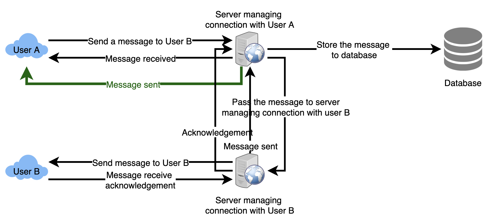
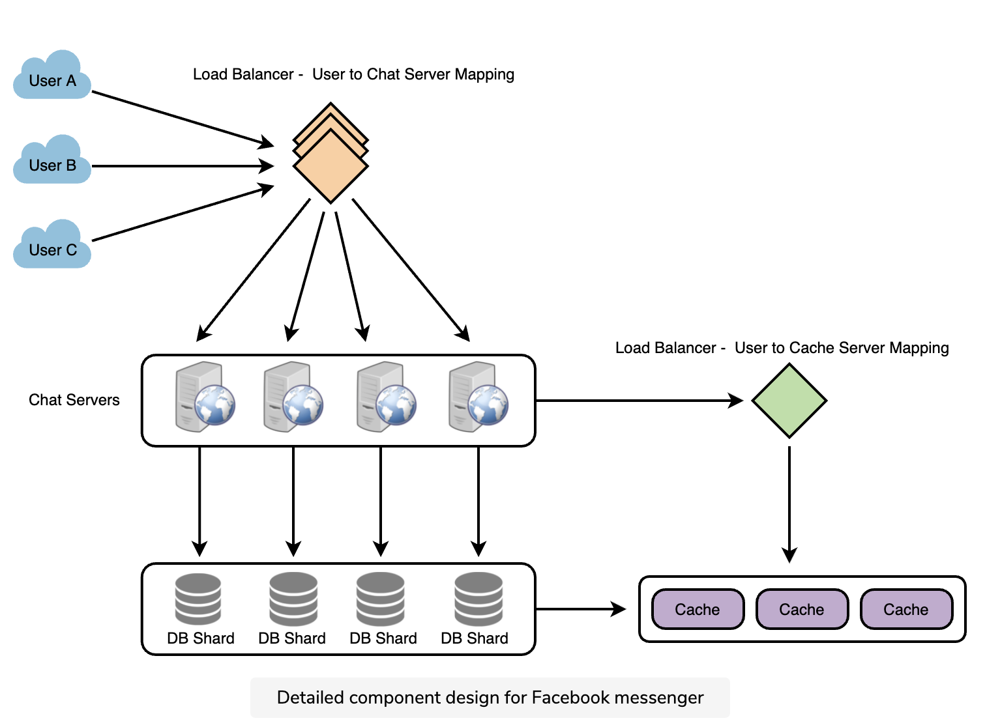

# Messenger

* Functional Requirements:
  * Messenger should support one-on-one conversations between users.
  * Messenger should keep track of the online/offline statuses of its users.
  * Messenger should support the persistent storage of chat history.
* Non-functional Requirements:
  * Users should have a real-time chatting experience with minimum latency.
  * Our system should be highly consistent; users should see the same chat history on all their devices.
  * Messenger’s high availability is desirable; we can tolerate lower availability in the interest of consistency.
* Extended Requirements:
  * Group Chats: Messenger should support multiple people talking to each other in a group.
  * Push notifications: Messenger should be able to notify users of new messages when they are offline.

## Architecture

* Server maintain a hash table, where “key” would be the UserID and “value” would be the connection object
* When server receives message for user, it looks up in hash table to find connection object and sends message on open request
* deliver message request
  1. Store the message in the database
  1. Send the message to the receiver
  1. Send an acknowledgment to the sender.
* Retrieving message from database
  * Start a separate thread, which will work with the database to store the message
  * Send an asynchronous request to the database to store the message

> Example

* Maintain sequence
  1. User-1 sends a message M1 to server for User-2
  1. Server receives M1 at T1
  1. Meanwhile, User-2 sends a message M2 to server for User-1
  1. Server receives message M2 at T2, such that T2 > T1
  1. Server sends the message M1 to User-2 and M2 to User-1

* How many chat servers do we need?
  * 500 million connections at any time
  * Assuming a modern server can handle 50K concurrent connections at any time, need 10K such servers.
* How do we know which server holds the connection to which user?
  * Software load balancer in front of our chat servers
  * That can map each UserID to a server to redirect the request

* How should clients efficiently fetch data from the server?
  * Clients should paginate while fetching data from the server
  * Page size could be different for different clients [ex] small cell phones, so fewer messages/conversations in viewport

## DB

* wide-column database solution like HBase

