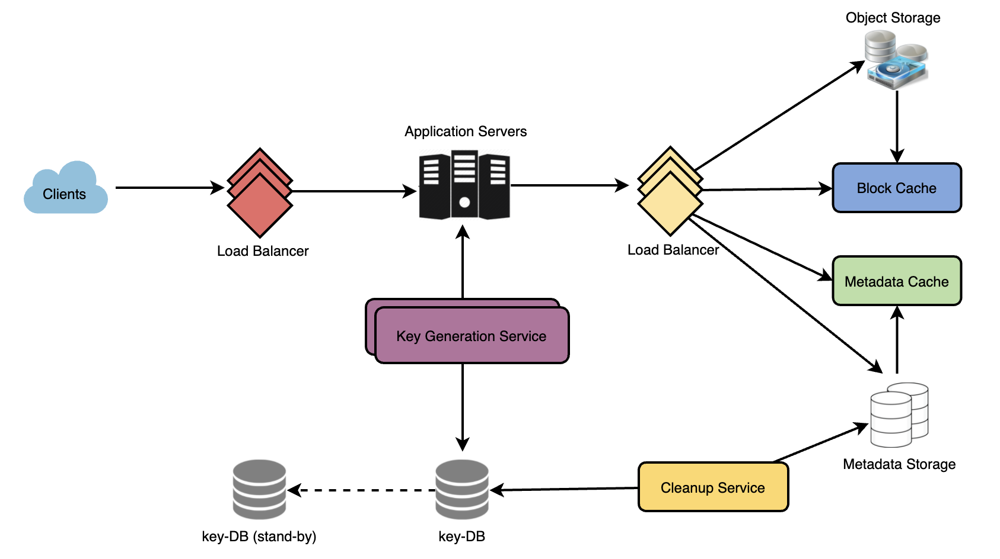

# Pastebin

<https://github.com/SeanHwangG/home/blob/main/software/design/pastebin/README.md>

* Functional
  * Users should be able to upload or “paste” their data and get a unique URL to access it
  * Users will only be able to upload text
  * Data and links will expire after a specific timespan automatically; users can specify expiration time
  * Users should optionally be able to pick a custom alias for their paste

* Non-Functional
  * The system should be highly reliable, any data uploaded should not be lost
  * The system should be highly available → If our service is down, users can’t access their Pastes
  * Users should be able to access their Pastes in real-time with minimum latency
  * Paste links should not be guessable (not predictable)

* Extended
  * Analytics, e.g., how many times a paste was accessed?
  * Our service should also be accessible through REST APIs by other services

## Architecture

* We need to store billions of records
* Each metadata object we are storing would be small (less than 1KB)
* Each paste object we are storing can be of medium size (it can be a few MB)
* There are no relationships between records, except if we want to store which user created what Paste
* Our service is read-heavy

* getPaste(api_dev_key, api_paste_key) -> textual data of the paste
* deletePaste(api_dev_key, api_paste_key) -> successful deletion returns ‘true’, otherwise returns ‘false’

> Example

* Upon receiving a read paste request, application service layer contacts datastore
* Datastore searches for the key, and if it is found, it returns the paste’s contents. Otherwise, error code is returned

## DB

> Solution

* Metadata: Relational database like MySQL or a Distributed Key-Value store like Dynamo or Cassandra
* Object storage: We can store our contents in an Object Storage like Amazon’s S3
