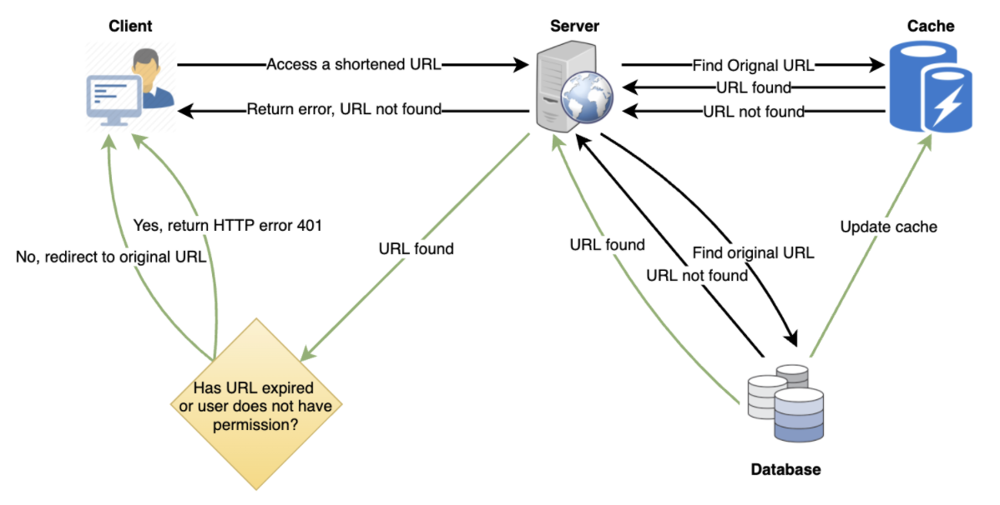

# Requirements

* Functional
  * Given a URL, service should generate a shorter and unique alias of it, called a short link
  * This link should be short enough to be easily copied and pasted into applications
  * When users access a short link, service should redirect them to the original link
  * Users should optionally be able to pick a custom short link for their URL
  * Links will expire after a standard default timespan → specify the expiration time

* Non-Functional Requirements
  * The system should be highly available →  if service is down, all the URL redirections will fail
  * URL redirection should happen in real-time with minimal latency
  * Shortened links should not be guessable (not predictable)

* Extended Requirements
  * Analytics; e.g., how many times a redirection happened?
  * Our service should also be accessible through REST APIs by other services

> Terms

* ratio: ratio between read and write (100:1)
* QPS_read: read query per second (20K)
* QPS_write: write query per second (200)
* duration: years to store (5 y)
* size: size of URL object (500 bytes)
* storage: storage needed (2003.15e7s/y+5y500bytes=15TB)
* band_write: bandwidth of incoming data (200500 bytes=100KB/s)
* band_read: bandwidth of reading data (20K500 bytes=10MB/s)
* cache: cache for 20% per day w/o dup (20K864000.2500bytes=170G)
* len: base64 encoding (646=68.7 bil)

## Database


> Problem

* Our service is read-heavy
* We need to store billions of records → Each object is small (less than 1K)
* There are no relationships between records other than storing which user created a URL
* base36 ([a-z ,0-9]) or base62 ([A-Z, a-z, 0-9])

> Solution

* NoSQL store like DynamoDB, Cassandra or Riak is a better choice
* Can take the hash of the ‘key’ or the short link to determine the partition in which we store the data object

## API

* createURL(api_dev_key, original_url, custom_alias=None, user_name=None, expire_date=None)

```txt
  Params:
    api_dev_key (str)    The API key of a registered account to throttle users based on quota.
    original_url (str)    Original URL to be shortened.
    custom_alias (str)    Optional custom key for the URL.
    user_name (str)    Optional user name to be used in the encoding.
    expire_date (str)    Optional expiration date for the shortened URL.
  Returns: (str)
    A successful insertion returns the shortened URL; otherwise, it returns an error code
```

* deleteURL(api_dev_key, url_key)

## Logic

* Hash vs KGS
  * Hash can be used concurrently
  * Key Generation Service (KGS) → simple, fast, no duplications and collisions



* Different hash functions?
  * MD5: 128-bit hash value
  * SHA256

* Range Based Partitioning vs Hash-Based Partitioning
  * unbalanced DB servers / overloaded partitions (consistent hashing)

* Load balance?
  * Clients and Application servers / Application and database servers / Application and Cache servers
  * Round Robin LB → periodically queries the backend server about its load and adjusts traffic

* Key duplication?
  * append an increasing sequence number to each input URL
  * append user id which should be unique → not signed in

* How to avoid KGS being a single point of failure?
  * Whenever the primary server dies, the standby server can take over to generate and provide keys

* How would we perform a key lookup?
  * We can look up the key in our database to get the full URL
  * If in DB, send “HTTP 302 Redirect”, passing the stored URL in the “Location” field of the request
  * If not in our system, issue an “HTTP 404 Not Found” status or redirect back to the homepage
