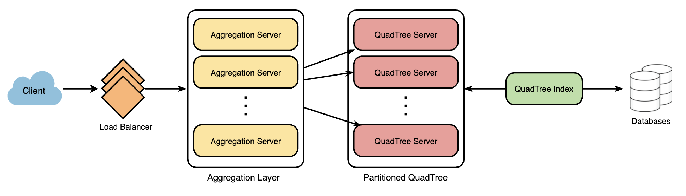

# Yelp

## Architecture

* Build Quadtree: keep repeating this process with each child node until there are no nodes left with more than 500 locations

* search(): JSON list of businesses matching the search query, with business name, address, category, rating, thumbnail
  * api_dev_key (string): The API developer key of a registered account, throttle users based on their allocated quota
  * search_terms (string): A string containing the search terms
  * user_location (string): Location of the user performing the search.
  * radius_filter (number): Optional search radius in meters.
  * maximum_results_to_return (number): Number of business results to return.
  * category_filter (string): Optional category to filter search results, e.g., Restaurants, Shopping Centers, etc.
  * sort (number): Optional sort mode: Best matched (0 - default), Minimum distance (1), Highest rated (2).
  * page_token (string): This token will specify a page in result set that should be returned.

## DB

> Example

* Should we keep our index in memory?
  * Maintaining index in memory will improve performance of our service
  * Keep our index in a hash table where ‘key’ is the grid number and ‘value’ is the list of places contained in that grid
