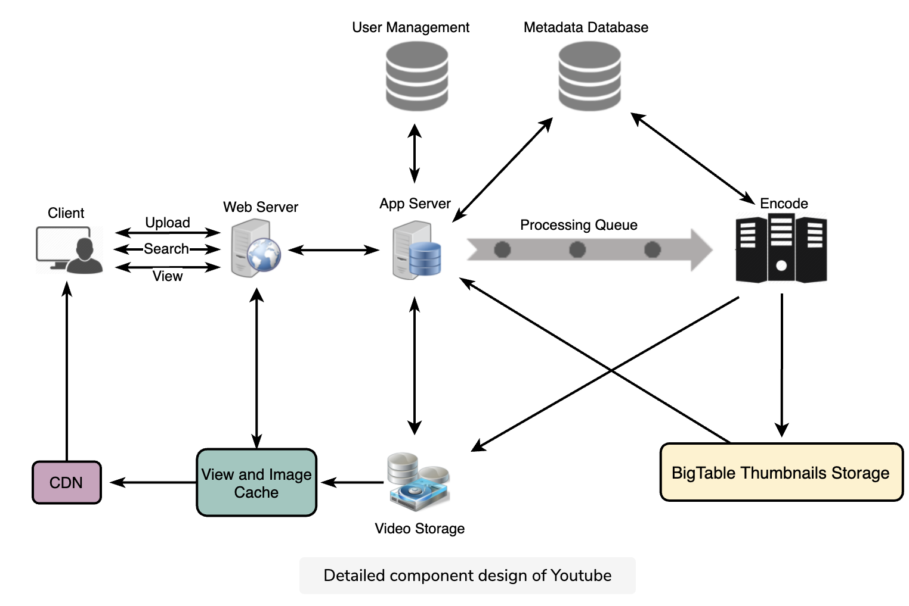

# Youtube

## API

* uploadVideo() -> successful upload will return HTTP 202
  * api_dev_key
  * video_title,
  * video_description,
  * tags[],
  * category_id,
  * default_language, recording_details, video_contents)

* searchVideo(): JSON containing information about the list of video resources matching the search query
  * api_dev_key
  * search_query
  * user_location
  * maximum_videos_to_return
  * page_token

* streamVideo(): media stream (a video chunk) from the given offset
  * api_dev_key
  * video_id
  * offset: time in seconds from the beginning of the video
  * codec
  * resolution

## Architecture

> Question

* 1.5 billion total users, 800 million of whom are daily active users
  * total video-views per second: 800M * 5 / 86400 sec => 46K videos/sec
* upload:view ratio is 1:200, [ex] for every video upload we have 200 videos viewed
  * 46K / 200 => 230 videos/sec

* Where would videos be stored?
  * Distributed file storage system like HDFS or GlusterFS

* Video duplication?
  * Data Storage: We could be wasting storage space by keeping multiple copies of the same video.
  * Caching: Duplicate videos result in degraded cache efficiency by taking up space that could be used for unique content
  * Network usage: Duplicate videos increase amount of data that must be sent over network to in-network caching systems
  * Energy consumption: Higher storage, inefficient cache, and network usage could result in energy wastage.
  * Video matching algorithms: [ex] Block Matching, Phase Correlation, etc

## DB

* Video metadata storage - MySql
* Videos metadata can be stored in a SQL database. The following information should be stored with each video:

* Video
  * VideoID
  * Title
  * Description
  * Size
  * Thumbnail
  * Uploader/User
  * Total number of likes
  * Total number of dislikes
  * Total number of views

* Comment
  * CommentID
  * VideoID
  * UserID
  * Comment
  * TimeOfCreation
  * User data storage - MySql
  * UserID, Name, email, address, age, registration details, etc.

> Question

* Where would thumbnails be stored?
  * Maximum of 5KB each, read heavy
  * Bigtable: Thumbnale many seeks to different locations on the disk to read these files

* Every minute 500 hours worth of videos are uploaded to Youtube
  * One minute of video needs 50MB of storage 500 h \* 60 m * 50MB => 1500 GB/min (25 GB/sec)

* CDN: Machines make heavy use of caching and can mostly serve videos out of memory
  * Replicate content in multiple places
  * Less popular videos (<20 views/day) that are not cached by CDNs can be served by our servers in various data centers
