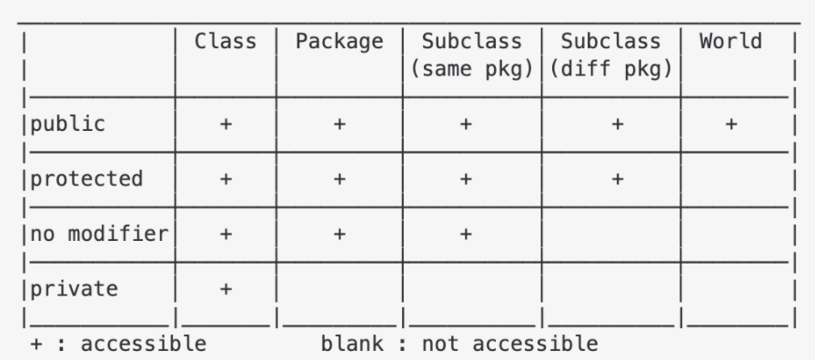

# OOP

## Scope






* private: Members declared as private are accessible only within the same class
* protected: Only the class and its child classes can access protected members
* extern: specifies variable / function is defined in another translation unit → must be applied all other files
* friend: friend class can access private and protected members of other class where it is declared as a friend
* struct: members and base classes are public by default in structs

```cpp
// 1. B can see A private, but A cannot see B private
class A {
  private:
    int x;
    friend class B;
};

class B {
  private:
    int y;
};

// 2. Node struct
struct Node {
  int value;
  Node(int value) {
    this->value = value;
  }
};
```




> let vs var

* let variables are scoped to the immediate enclosing block denoted by { } (hence the block scope)

```js
{ let baz = "Bazz";}  // Reference error
console.log(baz);
```




* global: in a function if we want to do assignments / change them

* nonlocal
  * Nonlocal is similar in meaning to global. But it takes effect primarily in nested methods
  * w/o it variables are read-only (to write a variable create a new local variable in the innermost scope)

```py
# 1. global
def global_():
  def scope():
    a = 0

    def change_local():
      a = 1  # Variable 'a' is redefined as a local
      print(f'Inside change_local() \t {a}')     # 1

    def change_global():
      global a
      a = 2
      print(f'Inside change_global() \t {a}')    # 2

    def change_nonlocal():
      nonlocal a
      a = 3
      print(f'Inside change_nonlocal() \t {a}')  # 3

    global func_global

    def func_global():
      print("I am global function")


    print(f'Before \t {a}\n')
    change_local()
    print(f'After change_local() \t {a}\n')      # 0

    change_global()
    print(f'After change_global() \t {a}\n')     # 0

    change_nonlocal()
    print(f'After change_nonlocal() \t {a}\n')   # 3

  scope()
  print(f"outside scope \t {a}")                 # 2
  func_global()
```




### Module




* bits/stdc++: Combined all useful modules in c++
  * for mac put [stdc++.h](https://gist.github.com/6d0c327ea983800a01d78365aded0566) in /usr/local/include/bits




* python3 -m module.a

```py
# 1. Basic import
# module/api.py
constant = 5

# module/__init__.py
from .api import constant

# 2. circular import
### a.py
import b

def function_a():
    print('function_a')
    return b.function_b()

function_a()

### b.py
import a
def function_b():
  print('function_b')

def function_c():
  print('function_c')
  return a.function_a()
```

> Error

* Command '['/venv/bin/python3.7', '-Im', 'ensurepip', '--upgrade', '--default-pip']' returned non-zero exit status 1
  * sudo apt-get install python3.9-venv

* Cannot be found
  * python3 -c "import sys;print(sys.path)"
  * Add to PYTHONPATH

* RuntimeWarning: 'module.api' found in sys.modules after import of package 'module',
  but prior to execution of 'module.api'; this may result in unpredictable behaviour




* @ scope: indicates common package ownership for a set of packages

```js
// 1. Module alias
"_moduleAliases": {
  "@root"      : ".", // Application's root
  "@deep"      : "src/some/very/deep/directory/or/file",
  "@my_module" : "lib/some-file.js",
  "something"  : "src/foo", // Or without @. Actually, it could be any string
}

/* in the main file of the app use this: */
require('module-alias/register');
```




* scriptlet: shared script with extension .sh which should be sourced
* package + :: + function() ([ex] dir/function.sh : function dir::function())






### Namespace




```cpp
#include <cstdio>
#include <iostream>
#include <string>
using namespace std;

namespace bw {
const std::string prefix = "(bw::string)";
class string {
  std::string _s = "";
  string();

 public:
  string(const std::string &s) : _s(prefix + s) {}
  const char *c_str() const { return _s.c_str(); }
};
};  // namespace bw

int main() {
  const string s1("This is a string");
  puts(s1.c_str());

  const bw::string s2(s1);
  cout << s2.c_str() << endl;
  return 0;
}
```




## Class




* any instance variables that are declared const can be initialized only in an initializer list
* A class is abstract if it has at least one pure virtual function

> Terms

* Member initializer list
  * Your class has a reference member
  * Your class has a non static const member or
  * Your class member doesn't have a default constructor
  * For initialization of base class members
  * MyClass(int a, int b, int c):a(a),b(b),c(c){}

* Uniform initialization
  * Implicit type conversion is disabled

```cpp
#include <cstdio>
#include <iostream>
#include <string>
#include <vector>
using namespace std;

// 1. Function Declaration / implementation
bool BitParser::getBitAt(int buffer, int bitIndex) {
  bool isBitSet = false;
  return isBitSet;
}

// 2. class related errors
class Movie
{
public:
  // Movie(){};
  ~Movie() { delete director_; }
  string &GetTitle() const;
  void SetTitle(string title);

private:
  // error: field has incomplete type 'A'
  // -> shared_ptr<Movie> mv; works
  // Movie mv;
  string title_;
  string *director_;
};

// error: out-of-line definition of 'GetTitle' does not match any declaration in 'Movie'
// -> const is missing
// string& Movie::GetTitle() {}

// error: C++ requires a type specifier for all declarations
// Movie::setTitle(string title) : title(title) {}

// error: only constructors take base initializers
// void Movie::SetTitle() : title_(title) {}

int main() {
  // error: no matching constructor for initialization of 'Movie'
  // -> Movie(string name) { director_ = new string(name); }
  // Movie harry_potter("sean");

  // error for object 0x1: pointer being freed was not allocated
  // -> Person(const Person& rhs) = delete; // check in compile time
  Movie titanic;

  // error: redefinition of 'titanic'
  // -> check for same variable name
  // Movie titanic;

  // error: type 'Movie' does not provide a call operator
  // -> overload operator()
  // titanic();

  // error: no viable overloaded '='
  // -> overload operator =
  // titanic = 1;

  // error: no member named 'length' in 'Movie'
  // -> create member variable length
  // titanic.length;

  // error: invalid operands to binary expression ('std::__1::ostream' (aka 'basic_ostream<char>') and 'B')
  // std::cout << titanic;

  // ld: symbol(s) not found for architecture x86_64
  // -> ldd a.o # check for dependency and see whether missing .cpp implementation
  // titanic.GetTitle();
}
```

> error: no viable conversion from 'Movie *' to 'Movie'

```cpp
Movie m = new Movie;   // Bad
Movie* m = new Movie;  // Good
```




* can extend from only 1 base class
* start with a capital letter by convention

> Terms

* Concrete: Classes from which objects can be instantiated (no abstract methods)

```java
// 1. Repalce object with class
/* BAD */
String[] row = new String[2];
row[0] = "Liverpool";
row[1] = "15";

/* GOOD */
Performance row = new Performance();
row.setName("Liverpool");
row.setWins("15");
```




* Private variable is started with #
* JavaScript, class methods are not bound by default → arrow function
* this: refers to current object in a method or constructor
  * Invoke current class constructor / method
  * Return the current class object
  * Pass an argument in the method / constructor call

```js
class Foo {
  constructor(name){
    this.name = name
  }
  display(){
    console.log(this.name);
  }
}

var foo = new Foo('Saurabh');
foo.display(); // Saurabh

// The assignment operation below simulates loss of context
// similar to passing the handler as a callback in the actual
// React Component
var display = foo.display;
display(); // TypeError: this is undefined
```




* created at runtime, and can be modified further after creation
* normally class members are public, and all member functions are virtual
* namespace of the class
* \<ClassName>.\_\_dict__
* \<Instance>.\_\_dict__

> Dataclass

* Work in python 3.7 or above
* implement a .\_\_repr\_\_() and an .\_\_eq__() method that can do basic object comparisons

* init: Add .\_\_init__() method? ([ex] **True**)
* repr: Add .\_\_repr__() method? ([ex] **True**)
* eq: Add .\_\_eq__() method? ([ex] **True**)
* order: Add ordering methods? ([ex] **False**)
* unsafe_hash: Force the addition of a .\_\_hash__() method? ([ex] **False**)
* frozen: If True, assigning to fields raise an exception. ([ex] **False**)

* field()
  * repr: [ex] **True**
  * defaults: [ex] None

```py
from dataclasses import dataclass, field
from math import asin, cos, radians, sin, sqrt

# Dataclass
@dataclass
class DataClassCard:
  rank: str
  suit: str = "1"

# 1. Position = make_dataclass('Position', ['name', 'lat', 'lon'])  # Equivalent
class RegularCard
  def __init__(self, rank, suit = "1"):
    self.rank = rank
    self.suit = suit

  def __repr__(self):
    return (f'{self.__class__.__name__}' f'(rank={self.rank!r}, suit={self.suit!r})')

  def __eq__(self, other):
    if other.__class__ is not self.__class__:
      return NotImplemented
    return (self.rank, self.suit) == (other.rank, other.suit)

# 2. geolocation
@dataclass(order=True)
class Position:
  name: str = field(compare=False)
  lon: float = 0.0
  lat: float = 0.0

  def distance_to(self, other):
    r = 6371  # Earth radius in kilometers
    lam_1, lam_2 = radians(self.lon), radians(other.lon)
    phi_1, phi_2 = radians(self.lat), radians(other.lat)
    h = (sin((phi_2 - phi_1) / 2) ** 2 + cos(phi_1) * cos(phi_2) * sin((lam_2 - lam_1) / 2)**2)
    return 2 * r * asin(sqrt(h))

seoul = Position('Seoul', 100.8, 59.9)
oslo = Position('Oslo', 10.8, 59.9)
vancouver = Position('Vancouver', -123.1, 49.3)

print(f"oslo to vancouver is {oslo.distance_to(vancouver)}km away")
print(list(sorted([oslo, vancouver, seoul])))
```






### Static




* static automatically initialized to 0
* only access static members, accessed using only class name and scope resolution operator
* function can be called even if no objects of the class exist
* variables begins first time program flow encounters declaration and ends at program termination

```cpp
ClassName::static_var_name = 0;

// 1. static function with unresolved linking doesn’t throw error if not called
void Log(const char* message);
int Multiply(int a, int b) {    // with static no linking error
    Log("Multiply");
    return a * b;
}
int main() { cout << "HI"; }    // Linking error

// 2. Doesn’t get destroyed out of function
int* function() {
  static int a = 2;
  return &a;
}

int main() {
  int* pa = function();
  printf("%d \n", *pa);  // 2
}

// 3. Initialized once in each function
void function() {
  static int cnt = 0;
  cnt++;
  printf("function called : %d \n", how_many_called);
}
void function2() {
  static int how_many_called = 0;
  cnt++;
  printf("function 2 called : %d \n", how_many_called)
}

function();    // 1
function2();   // 1
function();    // 2
function2();   // 2

// 4. Must be defined outside the class declaration.
class BufferedOutput{
   static void ResetCount() { bytecount = 0; }
   static long bytecount;
};
long BufferedOutput::bytecount;

// 5. Can be accessed using the member-selection (. and ->)
BufferedOutput Console;
long nBytes = Console.bytecount;
```




```java
// 1. Replace temp with Query
/* Bad */
class Report {
  void sendReport() {
    Date nextDay = new Date(previousEnd.getYear(),
      previousEnd.getMonth(), previousEnd.getDate() + 1);
  }
}

/* Good */
class Report {
  void sendReport() {
    Date newStart = nextDay(previousEnd);
  }
  private static Date nextDay(Date arg) {
    return new Date(arg.getYear(), arg.getMonth(), arg.getDate() + 1);
  }
}
```




### Access Modifier

* Encapsulation




* public
* private
* protected

> non-access modifiers

* final: Cannot reassign value, throws compiler error if not initialized (initializer or assign), or reassigned
  * variable: constant variable
  * methods: prevent method overriding
  * classes: prevent inheritance

```java
// 1. Use getter and setter for complex getter, setter ([ex] lazy), or redefine in subclass
class Person {
  public String name;
}
class Person {
  private String name;

  public String getName() {
    return name;
  }
  public void setName(String arg) {
    name = arg;
  }
}

class Range {
  private int low, high;
  boolean includes(int arg) {
    return arg >= low && arg <= high;
  }
}
class Range {
  private int low, high;
  boolean includes(int arg) {
    return arg >= getLow() && arg <= getHigh();
  }
  int getLow() {
    return low;
  }
  int getHigh() {
    return high;
  }
}
```




### Abstract




> abc

* ABC: A helper class that has ABCMeta as its metaclass

* abstractmethod: decorator indicating abstract methods
  * requires that the class’s metaclass is ABCMeta or derived

```py
class C(ABC):
  @abstractmethod
  def my_abstract_method(self, ...):
    ...

  @classmethod
  @abstractmethod
  def my_abstract_classmethod(cls, ...):
    ...

  @staticmethod
  @abstractmethod
  def my_abstract_staticmethod(...):
    ...

  @property
  @abstractmethod
  def my_abstract_property(self):
    ...

  @my_abstract_property.setter
  @abstractmethod
  def my_abstract_property(self, val):
    ...

  @abstractmethod
  def _get_x(self):
    ...

  @abstractmethod
  def _set_x(self, val):
    ...

  x = property(_get_x, _set_x)
```




### Constructor




* Default copy constructor automatically created → avoid if using heap in constructor
* = default;: should define constructor
* Delete implicitly-declared copy constructor
* T has non-static data members that cannot be copied or member of rvalue reference type
* T has direct / virtual base class that cannot be copied or a deleted or inaccessible destructor

```cpp
#include <iostream>

// 1. uniform_initialization
int x = f(2) + g(3);  // unspecified whether f() or g() is called first

class A {
 public:
  A() { cout << "A constructor!" << endl; }
};

A a{};      // Initialization
A b();      // Define Function b that returns A
```




* \_\_init\_\_: called when object is created

```py
# 1. set multiple args
def __init__(self, **kwargs):
  valid_keys = ["title", "first_name", "last_name", "is_guest", "company_name", "mobile", \
    "landline", "email", "password", "fax", "wants_sms_notification", "wants_email_notification", "wants_newsletter","street_address"]
  for key in valid_keys:
    setattr(self, key, kwargs.get(key))
```




### Destructor




* the function, program, or a block containing local variables ends, or a delete operator is called
* X static, const, private, arguments, any return type
* Objects are destroyed in reverse order of their creation
* object class with a Destructor cannot become a member of the union
* The programmer cannot access the address of destructor

```cpp
#include <iostream>
using namespace std;

// 1. Destructor order
int i;
class A {
 public:
  ~A() { i = 10; }
};
int foo() {
  i = 3;
  A ob;
  return i;
}

cout << foo() << endl;  // 3
cout << i;              // 10 (called destructor after function)
```




### Instance Variable




* Can be accessed through class name and any instance of the class
* If access using `self.<ClassVariable>`, the value is changed only for the instance
  * Optional to method

```py
from glom import glom

# 1. Optional Chaining
target = {'a': {'b': {'c': 'd'}}}
glom(target, 'a.b.c')
getattr(getattr(foo, 'bar', None), 'baz', None)

# 2. Get with timeout
def get(self, timeout=None):
  if timeout is None:
    self.timeout = timeout
```




## Association

* Bidirectional: Add a field for holding the reverse association
  * set one as dominant, with methods that create or update the association
  * create utility method for establishing association in non-dominant class, with given parameters to complete field
  * [+] only way to get associated object, or fast calculation
  * [-] much harder to implement, make classes interdependent

## Inheritance

* [+] Type hinting for methods, Open closed (delete the control flow code)




* Virtual
  * a member function which is declared within a base class and overridden by a derived class
  * The resolving of function call is done at Run-time

```cpp
struct Animal {
  string type;
  Animal(){};
  Animal(string type) : type(type) {}
  ~Animal() {}
  virtual void hi() { cout << type << endl; }
};

class Person : public Animal {
 private:
  string name;

 public:
  Person(){};
  Person(string name) : Animal("Person"), name(name) {}
  Person(const Person &p) : Animal("Person"), name(p.name) {}

  void setName(string name) { this->name = name; }
  string getName() { return name; };
  string getName() const { return "const " + name; };
  void hi() override  // override can be ommited but catch compiler error like hi() const
  {
    cout << type << " : " << name << endl;
  }
  void hi() const { cout << type << " : " << name << " const" << endl; }
};

void inheritance() {
  // Down casting
  vector<Animal *> animals = {new Animal("Dog"), new Person("sean")};
  const Person sean = Person("tom");
  for (auto animal : animals) animal->hi();
  sean.hi();
}
```




* Interfaces contain no method definitions, no constructors, and only public static final variable
* Classes may implement multiple interfaces
* An interface may extend multiple interfaces

* interface Set extends Collection

* Abstract: classes must be defined abstract if at least one method in the class definition is defined abstractly
  * classes which are too generic to be instantiated as objects (cannot create abstract object)

```java
// 1.Simple Inheritance
public static class Super {
    public void meth(Super other) { System.out.println( "1 - in Super.meth(Super)");}
}

public static class Sub extends Super {
    @override
    public void meth(Super other) { System.out.println("2 - in Sub.meth(Super)");}
    public void meth(Sub other) { System.out.println("3 - in Sub.meth(Sub)");}
}

public class MethodTest {
  public static void main(String[] args) {
    Super sup = new Super();
    Sub sub = new Sub();
    Super sup_ref_sub = new Sub();

    sup.meth(sup);                  // 1
    sup.meth(sup_ref_sub);          // 1
    sup.meth(sub);                  // 1

    sup_ref_sub.meth(sup);          // 2
    sup_ref_sub.meth(sup_ref_sub);  // 2
    sup_ref_sub.meth(sub);          // 2

    sub.meth(sup);                  // 2
    sub.meth(sup_ref_sub);          // 2
    sub.meth(sub);                  // 3
  }
}
```




* extends: possible for interface to extends any object-like type

```js
// 1. Bear Animal using type exte
/* Using type */
type Animal {
  color: string
}

type Bear = Animal & {
  honey: Boolean
}

const bear = getBear()
bear.name

type Bear = {  // not possible: Bear should be interface
  hungry: Boolean;
}

export type ZooBear = Bear & ZooAnimal;  // intersect types

/* Using interface */
interface Animal {
  color?: string;
}

interface Bear extends Animal {
  honey: boolean
}

const bear = getBear()
bear.name

interface Bear extends Animal {
  hungry: boolean;  // possible
}

```




* Changes apply to subclass first
* help(ClassName) to explore more about the class
* \_\_subclasses\_\_: iterate over subclasses
* search for attributes inherited from a parent class as depth-first, left-to-right,
* Type[]: [ex] Type[`parent`]: Typing for `Parent` like class

> method

* isinstance(manager1, Manager)
* issubclass(manager1, Employee)

```py
class Developer(Employee):
  def __init__(self, first, last, prog_lang):
    super().__init__(first, last, pay)
    self.prog_lang = prog_lang
```

> TypeError: Cannot create a consistent method resolution

```py
class Player:
  pass

class Enemy(Player):
  pass

class GameObject(Player, Enemy):
  pass

g = GameObject()
```

* GameObject is inheriting from Player and Enemy. Because Enemy already inherits from Player



