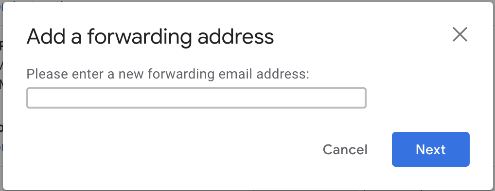

# Software Engineering

> Term

* Prototyping: creating prototypes of software apps ([ex] incomplete versions of the software program being developed)
  * activity that can occur in SDE, comparable to prototyping in other fields, [ex] mechanical engineering manufacturing
* breakdown of project activities into linear sequential phases
  * where each phase depends on the deliverables of previous one and corresponds to a specialisation of tasks

* KISS principle: simplicity should be a key goal in design
* Feature ownership: point of contact, aware / discuss schedule, responsibility
* Iteration (sprint): Trying to make a large project act like a small one  Default to 20 days
  * How much communication do I need to have with the customer? How much risk?
  * Rapid feedback from the customer to avoid deviating from the customer’s wants on premise
  * all computing resources are accessed and managed by premises
* Meeting: Learn progress, status -> Update big board
  * Surface problems that are slowing things downj
* Milestone: Project get paid after milestone
* Standup questions
  * What have you accomplished since the last standup?
  * What did you learn that would be valuable for the team to know?
  * What's impeding you?
  * What do you intend to do before the next stand up?
* Task: risk addressed (unseen technical requirements and risks)
  * inaccurate estimates, no division of labor
* User Story: keep the end goal in mind from the user's perspective
  * prevent things like feature creep and facilitate communication between all stakeholders
  * Describes an observable end-user feature in customer language
  * Can have direct feed-back from the customer
  * Planning poker to decide estimates
  * In BDD, disambiguating user stories using sequence and special cases (multiple scenarios per story)
  * BDD is covered by matching automated story test
  * [ex]
    As a person who like to walk: Who will benefit from the feature?
    I want to have an accurate measure of the distance I traveled: Not a system capability (task)
    So that I can see how far I walk every day: Benefit in the world

> Question

* Break following user story into two
  * Scenario 1: Favorite a New Route
    * Given that the user is on the Save Route screen
    * And they are saving a route named “RouteA”
    * When the user presses the “Favorite” button
    * And then they press the “Save” button
    * Then the app should go to the Routes page
    * And “RouteA” should be shown as a favorite
  * [ex]
    As a user I want to message a nearby buddy so that we can meet up.  →
    As an initiator I want to send invitation to a nearby buddy so that we can meet up
    As a user I want to receive messages so that we can meet up

## Code Review

* should avoid API discussion: should happend before code is written
* Automated as possible: Linter and CI
* Readability: Type, function and variable name
  * complex code should be commented
  * Important actions should be logged
* Side effect: Function should be as pure as possible
* Limits
  * Null, singular case
  * Unexpected / Large input from user

## Delivery

> Terms

* [Open source](https://naver.github.io/OpenSourceGuide/book/)

* Bill of materials
* CRM (Customer Relationship Management)

* CPM (Cost per Mili): cost an advertiser pays for one thousand views or clicks of an advertisement

* MVP (minimum viable product): technique in which a product is developed with sufficient features for early adopters

* POC (Proof of concept): check before releasing the product
* RCA (Root cause analysis): Find why customer act something
* SKU (stock-keeping unit): a unique identifier for each distinct product and service that can be purchased in business

* Release
  * Canary deploy: rollout new model with small subset of users, then monitor its performance
  * Binary Release: most windows machines do not have a compiler installed
  * Source Release: common in linux. b/c vary in cpu, installed library, kernel, compilers version
  * Blue-Green deploy: two complete deployments with active (rolled out) + idle (test)
  * Maintenance Release: release of a product that does not add new features or content

## Email




1. Settings on top right
  
1. See all Settings
1. Forwarding and POP/IMAP
1. Add a forwarding address
  




## Extreme Programming

* development methodology to improve software quality, responsiveness to changing customer requirements

> Term

* YAGNI: programmer should not add functionality until deemed necessary

## Agile

* Paradigm involve discovering requirements, developing solutions with self-organizing, cross-functional teams and end users

* Manifesto for Agile Software Development is based on twelve principles
  1. Customer satisfaction by early and continuous delivery of valuable software.
  1. Welcome changing requirements, even in late development.
  1. Deliver working software frequently (weeks rather than months)
  1. Close, daily cooperation between business people and developers
  1. Projects are built around motivated individuals, who should be trusted
  1. Face-to-face conversation is the best form of communication (co-location)
  1. Working software is the primary measure of progress
  1. Sustainable development, able to maintain a constant pace
  1. Continuous attention to technical excellence and good design
  1. Simplicity—the art of maximizing the amount of work not done—is essential
  1. Best architectures, requirements, and designs emerge from self-organizing teams
  1. Regularly, the team reflects on how to become more effective, and adjusts accordingly

## Leadership

* tech skills != leader: lead should not be someone with best techinical ability (competitiveness, imposter syndrome)
* Do not focus too much on tech: recruitment, budgets, performance reviews, persuading, coaching
* Keep developers productive, team around them work to remove any obstacles or distractions

> Terms

* One-One Meeting: Recurring, private, Open-ended leading questions, listen, and take notes
  * Their opinion of the team and their performance
  * Details about individuals: Are they superstars or struggling?
  * Framing of the current project or workstream: How long have they been doing it? Has it changed much?
  * Thoughts on how best to work with them, You don’t necessarily have to follow this, but another opinion always helps
  * General advice about how to do your role within the organization

> Example

* Email: Your primary source of incoming messages, Do not delete, Keep it clean

> Reference

<https://www.thoughtworks.com/insights/blog/techie-tech-lead-my-5-biggest-mistakes>
<https://www.educative.io/courses/become-an-effective-engineering-manager>

## License

> Terms


* Apache
  * [ex] Gitbook

* BSD License
  1. Permission to use, copy, modify, and/or distribute this software for any purpose with or without fee is hereby granted
  2. Redistribution and use in source and binary forms, with or without modification, are permitted provided that redistributions
     * in source code must retain the above copyright notice, this list of conditions and the following disclaimer
     * in binary form must reproduce the above copyright notice,
       this list of conditions and following disclaimer in documentation and/or other materials provided with distribution
  3. Neither organization nor contributors may be used to endorse or promote products derived from this
     w/o specific prior written permission
  4. All advertising materials mentioning features or use of this software must display the following acknowledgement:
     This product includes software developed by the `organization`.

* MIT License: a permissive free software license originating at the MIT in the late 1980s
  * puts only very limited restriction on reuse and has, therefore, high license compatibility
  * compatible with many copyleft licenses, such as the GNU
  * [ex] Ruby on Rails, Nim, Node.js, Lua, jQuery, React, Angular, .NET core

  ```txt
  Copyright (c) <year> <copyright holders>

  Permission is hereby granted, free of charge, to any person obtaining a copy
  of this software and associated documentation files (the "Software"), to deal
  in the Software without restriction, including without limitation the rights
  to use, copy, modify, merge, publish, distribute, sublicense, and/or sell
  copies of the Software, and to permit persons to whom the Software is
  furnished to do so, subject to the following conditions:

  The above copyright notice and this permission notice shall be included in all
  copies or substantial portions of the Software.

  THE SOFTWARE IS PROVIDED "AS IS", WITHOUT WARRANTY OF ANY KIND, EXPRESS OR
  IMPLIED, INCLUDING BUT NOT LIMITED TO THE WARRANTIES OF MERCHANTABILITY,
  FITNESS FOR A PARTICULAR PURPOSE AND NONINFRINGEMENT. IN NO EVENT SHALL THE
  AUTHORS OR COPYRIGHT HOLDERS BE LIABLE FOR ANY CLAIM, DAMAGES OR OTHER
  LIABILITY, WHETHER IN AN ACTION OF CONTRACT, TORT OR OTHERWISE, ARISING FROM,
  OUT OF OR IN CONNECTION WITH THE SOFTWARE OR THE USE OR OTHER DEALINGS IN THE
  SOFTWARE.
  ```

* General Public License: guarantee end users the freedom to run, study, share, and modify the software
  * written by Richard Stallman, founder of the Free Software Foundation

## Refactor

> Term

* Blob: procedural-style design leads to one object with a lion’s share of the responsibilities
* Dead End: reached by modifying reusable component if modified component is no longer maintained, supported by supplier
* Lava Flow: dead code and forgotten design information is frozen in an ever-changing design
* Spaghetti Code: Ad hoc software structure makes it difficult to extend and optimize code
  * Problem
  No mentoring in place, ineffective code review, developers working in isolation
  Minimal relationships exist between objects
  The flow of execution is dictated by object implementation, not by the clients of the objects
  * Solution
  create domain model, extract commonality between domain objects to abstract, clarify objects, relationships in system
  requirements and design are specified in advance of the implementation, instead of occurring concurrently
