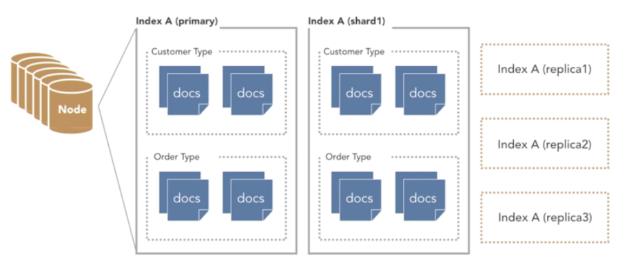

# Editor

* map
  * map / imap: normal, visual mode / insert mode
  * unmap: cancel mapping
  * inoremap: insert mode non recursive
  * n / i: normal / insert mode
  * v / s / x: visual select mode / select mode / visual mode only
  * c: command-line
  * l: lang-arg o pending
  * \<D\-: mac command
  * \<CR>: carriage return usually the Enter on your keyboard
  * :map: see current mapping
  * remap: makes mappings work recursively
  * nnoremap: one that works in normal mode
  * `<silent>`: show no message when this key sequence is used
  * `<leader>`: let mapleader = autocmd
  * `<C-l> <Esc>:w<CR>`:!clear;python %\<CR\>: run python script
  * filetype cpp nnoremap \<F5\>:w \<bar\> exec '!g++ -g -O2 -std=gnu++17 -static %'\<CR\>: run cpp

* -r .swp: recover swp file
* --version: Show version

## Copy




* yy: yank line
* dd: delete and copy current line
* ggyG: yank entire file
* :d: delete current line
* :m0: move current line to line 0
* :wqa: write close all
* :%w !pbcopy: copy to clipboard
* :r !pbpaste: paste from the clipboard
* :w !sudo tee %: without permission
* :3,5y: copy from line 3 to 5




## Highlight




* ctrl + v: multiple line
* U: Capitalize

```sh
ctrl + v | shift + i \# enter : python multiline comment
```




## Macro




* q[a-z][command]q
* @a

* :reg: Show all current macro
* "": unnamed | default register
* “+: clipboard
* "kyy: copy current line to register k
* “kp: paste k register




## Navigation




0 | $: begin | end of the line
^: first non-blank character
( | ): begin | end of the current paragraph
zt | z. | zb: cursor top | middle | bottom
H | M | L: move to top | middle | low of the page
w / W: jump by start of words (punctuation considered words / spaces separate words)
e / E: jump to end of words (punctuation considered words / no punctuation)

]] / [[: move the cursor a section forwards or to the next { / previous {

gg / G: go to first / last line
ge: jump backward to end of words
nG: go To line n

CTRL-f | b: scroll full screen forward | backward
CTRL-d | u: scroll half screen forward | backward




## Search Text

* Elastic Search

| SQL      | elasticsearch         |
| -------- | --------------------- |
| Database | Index                 |
| Table    | Type                  |
| Row      | Document              |
| Column   | Field                 |
| Schema   | Mapping               |
| Index    | Everything is indexed |
| SQL      | Query DSL             |

> Terms

* Cluster



* Documents: For single customer or order or an event resides in index
* Nodes: Part of the cluster that stores the data with search and index capabilities
  * Node names are lower-case and can have many of them

* Shard, Replica: portion of the index
* Indexes: Collection of similar documents

* Types
  * category or partition of index

```text
<REST verb> <Index> <Type> <ID>
```




* algolia
  * full-text search
  * client
    * SearchClient.create('key', 'cred'): create client
  * index
    * client.init_index('page'): create index
    * clear_objects(): remove all objects
    * save_objects()




* /copy\C / \c: Case sensitive / insensitive
* \*: Search current word forward
* #: Search current word backward
* :g/pattern/d: delete all line matching patterns
* :g!/pattern/d
* :g/^\s*$/d: delete all blank lines
* :g/^$/d: Delete empty line
* \c: ignore case
* :s/sunny/(&)/: & is matched text
* :g/pattern/m$: Move all lines matching a pattern to end of file

* f/Fx: search line forward / backward for 'x'
* t/Tx: search line forward / backward before 'x'






### Bookmark

* Ability to move to specific line




* :marks: list all the current marks
* :delmarks a: delete mark
* ma: make a bookmark named a at the current cursor position
* `a: go to position of bookmark a
* 'a: go to the line with bookmark a
* `.: go to the line that you last edited




## Editing




* ~: Change the case of current character
* r: replace a single character (does not use insert mode)
* R: enter Insert mode, replacing characters rather than inserting
* J: join line below to the current one
* g~iw: switch case of current word
* guw: make current word lower / upper(U) case
* gu$: make lower / uppercase (U) until end of line
* ==: auto-indent current line

* Delete
  * x: delete current / previous character
  * dw: delete the current word
  * dd: delete (cut) a line
  * dt\': delete until the next ' character on the line (replace ' by any character)
  * D: delete from cursor to end of line
  * :[range]d: delete [range] lines

* Spelling
  * ]/[s: next / previous misspelled word
  * zg: add word to wordlist
  * zug: undo last add word
  * z=: suggest word

* :![cmd]: run terminal command
* :history: Last command
* :retab: Repace tab to spaces

```vim
<!-- lastline -->
command Gb :normal i  <CR> {% tab title=""} <CR>  <CR>  <ESC>
```




## Editor Files




* .vimrc: Located in home\(~\) directory, get run every time when open vim

* expand
  * ("%"): path/file.txt
  * ("%:t"): file.txt
  * ("%:r"): path/file
  * ("%:e"): txt
  * ("%:p:h"): /home/you/path/file.txt

```vim
<!-- 1. vimrc -->
:so ~/.vimrc            # apply vimrc

set num                 # show line number
syntax on               # coloring
set tabstop=4           # Change Tab into 4 spaces
set shiftwidth=4        # Change >> length to 4
set et                  # Convert tab to space
set hlsearch            # highlight all matches in a file when perform a search,
set incsearch           # highlight next match while you're still typing search pattern
verbose                 # where setting is from

set encoding=utf-8      # Korean support
set fileencodings=utf-8,cp949

# AUTOCOMPLETE RELATED
func! AutoClose(...)
  let cur = getline(".")[col(".")]
  if cur != a:1
  if a:1 == "'" || a:1 == '"'
    execute "normal!a".a:1.a:1
  else
    execute "normal!a".a:1
  endif
  execute "normal!h"
  else
  execute "normal!l"
  endif
endfunc

inoremap ( ()<left>
inoremap [ []<left>
inoremap { {}<left>
inoremap ) <ESC>:call AutoClose(')') <CR>a
inoremap ] <ESC>:call AutoClose(']') <CR>a
inoremap } <ESC>:call AutoClose('}') <CR>a
inoremap " <ESC>:call AutoClose('"') <CR>a
inoremap ' <ESC>:call AutoClose("'") <CR>a
inoremap {<CR> {<CR>}<ESC>O
inoremap {;<CR> {<CR>};<ESC>O

" COMMAND RUN related
func! RunScript(...)
  execute ":wa"
  let fileName = a:1
  let fileType = a:2

  if fileType == 'cpp'
  execute ":!g++ -std=c++11 -o ".fileName fileName.".cpp && cat ".fileName.".txt 2> /dev/null | ./".fileName
  elseif fileType == 'py'
  execute ":!cat input.txt 2> /dev/null |" "python3" fileName.".py"
  endif
endfunc

nnoremap <C-l> :call RunScript(expand('%<'), expand('%:e')) <CR>

""autocmd *.py nnoremap <F5> :w <CR>:!cat input.txt 2> /dev/null | python % <CR>

"" SYNTAX
syntax on
colorscheme evening
se nu tabstop=4 shiftwidth=4 softtabstop=4 smarttab expandtab autoindent
set hlsearch  " highlight search and search while typing
set incsearch

"" SCREEN
noremap <Left> <C-w><Left>
noremap <Right> <C-w><Right>

:e []/file        # Reload current file | Open new file

! : ignore vimrc mapping configure
execute "normal! ihello my name is sean"

startinsert
strftime("%c")
type(var) ==   type(0) / type(function("tr")) / type([]) / type({}) / type(0.0)

%              # current file name
q:             # history
:saveas        # save file as
```




## Editor Tab




* -p: Open with each tab ([ex] *.cpp)




## Split Tab




* -o: Open with horizontal split ([ex] *)
* -o: Open with vertical split ([ex] *)
* split
  * :tabe file: in a new tab
  * Ctrl+w+r: vsplit swap window
  * Ctrl+w+=: vsplit resize equal dimension
  * :vs file: in a split mode
  * :Sex / Vex: split and open file explore
  * :tabnew file: open as a new tap



