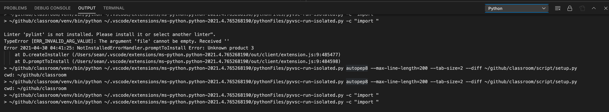
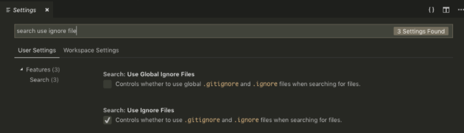

# IDE

* [enter without key](https://code.visualstudio.com/docs/remote/troubleshooting)
* github1s.com: show github in vscode

> Terms

* workspace: specific to a project and can be shared across developers on a project
  * override user settings

* Icons


```json
// wsname.code-workspace
// 1. Mutliple repository in a single workspace
{
  "folders": [
    {
      "path": "."
    },
    {
      "path": "../algorithm"
    },
    {
      "path": "../theory"
    },
    {
      "path": "../language"
    },
  ],
  "settings": {
    "editor.tabSize": 2
  }
}
```

> How to lint all files?

* VScode by default only lint openned files, so replace ; -> ; will force lint all files

## Setup

```sh
# 1. without password
ssh-keygen -t rsa -b 4096

export USER_AT_HOST="your-user-name-on-host@hostname"
export PUBKEYPATH="$HOME/.ssh/id_rsa.pub"
ssh-copy-id -i "$PUBKEYPATH" "$USER_AT_HOST"  # Linux host
ssh $USER_AT_HOST "powershell New-Item -Force -ItemType Directory -Path \"\$HOME\\.ssh\"; Add-Content -Force \
  -Path \"\$HOME\\.ssh\\authorized_keys\" -Value '$(tr -d '\n\r' < "$PUBKEYPATH")'"  # window host
```

### Error

> Formatting doesn't work



* VSCode doesn't recognize html linting
  * Check files associations in settings

> Error: Waiting for server log... (ssh)

* rm -rf $HOME/.vscode-server

> Invisible _ in terminal

* "terminal.integrated.fontSize": 13

### Shortcut

> Edit

* ⌘ d: edit multiple variables
* option up / down: move current code up / down
* ⌃ Space: trigger IntelliSense Suggestions
* ⇧ ⌥ a: toggle comment

> Navigation

* ⌘ o: Open file or folder
* ⌘ t: jumping to symbol
* ⌘ shift f / h: find / replace words in all files
* ⌘ shift o: find symbol / move to method (with corresponding language extension)
* ⌘ shift .: See all methods
* ⌘ option click: Open Side
* ⌘ click: Replace / Click again to go back
* ⌃ (⇧) -: Navigate back (forward)

> Replace

* uses () and refernce with $1 for capture group

> Select

* ⌘ click: Multi-line cursor
* ⇧ ⌥ drag: Multi-line cursor
* ⌃⇧⌘←/→: expand / shrink select

> Screen

* ⌘ E: Find given word
* ⌘ B: Toggle Sidebar
* ⌘ k: zenmode
* ctrl 1: Focus on editor
* ⌘ K ⌘ /: Fold all block comments
* ⌘ shift B: Build and debug
* shift ⌘ M: jump to errors and warnings in the project
* option ⌘ [: Code folding
* ⌘ k ⌘ 0 / j: Fold / unfold all codes

> Terminal

* ⌃ `: Focus on terminal
* ⌃ shift `: New terminal
* ⌘ ⌥ ← / → / ↑ / ↓: Toggle between pane / terminal

## VSCode File

* ${env:`PATH`}: get `PATH` from environment
* ${workspaceFolder}: workspace forder path
* ${default}: default value
* ${file}: current opened file (ex: /home/your-username/your-project/folder/file.ext)
* ${fileBasename} - file.ext
* ${fileBasenameNoExtension} - file
* ${fileDirname}: /home/your-username/your-project/folder
* ${relativeFile}: folder/file.ext
* ${workspaceFolderBasename}: your-project
* ${pathSeparator}: / on macOS or linux, \\ on Windows

### Settings.json



* workspace: overwrite user level settings, located in .vscode/settings.json
* user level: located in ~/.vscode/settings.json




> Cmake Tools

* Cmake: Reset CMake Tools Extension State
* configure

```json
// An object containing key : value pairs, which will be passed onto CMake when configuring
// It does the same thing as passing -DVAR_NAME=ON via cmake.configureArgs.
{
  "cmake.configureSettings": {"KEY" : "{env:VAR}"}
}

// c_cpp_properties.json
{
  "configurations": [
  {
    "name": "Linux",
    "intelliSenseMode": "gcc-x64",
    "includePath": [
    "${workspaceFolder}/src",
    "${workspaceFolder}/lib",
    "${workspaceFolder}/test",
    "~/SFML-2.5.1/include",
    "/usr/local/include/**",
    "/usr/include/**"
    ],
    "defines": [ "_DEBUG" ],
    "cStandard": "c11",
    "cppStandard": "c++17",
    "forcedInclude": [ "${workspaceFolder}/src/PCH.hpp" ]
  },
  {
    "name": "Mac",
    "intelliSenseMode": "${default}",
    "compilerPath": "/usr/bin/clang",
    "macFrameworkPath": [
    "/Library/Frameworks",
    "/System/Library/Frameworks"
    ],
    "includePath": [
    "${workspaceFolder}/src",
    "${workspaceFolder}/lib",
    "${workspaceFolder}/test",
    "/usr/local/include/**"
    ],
    "defines": [ "_DEBUG" ],
    "cStandard": "c11",
    "cppStandard": "c++17",
    "forcedInclude": [ "${workspaceFolder}/src/PCH.hpp" ]
  },
  {
    "name": "Win32",
    "intelliSenseMode": "gcc-x64",
    "compilerPath": "C:/mingw32/bin/gcc.exe",
    "includePath": [
    "${workspaceFolder}/src",
    "${workspaceFolder}/lib",
    "${workspaceFolder}/test",
    "C:/SFML-2.5.1/include"
    ],
    "defines": [
    "_DEBUG",
    "UNICODE",
    "_UNICODE"
    ],
    "cStandard": "c11",
    "cppStandard": "c++17",
    "forcedInclude": [ "${workspaceFolder}/src/PCH.hpp" ]
  }
  ],
  "version": 4
}
```




```json
// Settings.json
{
  // General
  "editor.fontSize": 14, // Controls the font size in pixels
  "editor.rulers": [100], // No rulers are drawn if array is empty
  "editor.wordWrapColumn": 120,
  "editor.formatOnSave": true,
  "files.autoSaveDelay": 1000, // Controls the delay in ms after which a dirty file is saved automatically
  "files.exclude": {                   // don't show in file explorer
    ".vscode/launch.json": true,
    "env/windows/*.sh": true,
    "env/osx/dmg.applescript": true,
    "bin/": true,
    "build/": true,
  },

  // Use environment variable ${env:Name}
  "args": ["${env:USERNAME}"]

  // c++ related
  "C_Cpp.clang_format_style": "file",                            // use .clang-format in current / home directory
  "C_Cpp.default.configurationProvider": "ms-vscode.cmake-tools", // use CMakeLists.txt for linting
  "editor.wordWrapColumn": 120,
}
```

> java extension package

* java.home: set Java IDK location

```json
"java.home" : "/software/CSE/oracle-java-se-14/jdk-14.0.2"
```




* sort import

```json
"python.formatting.autopep8Args": [
  "--max-line-length=200"
],
"python.linting.pylintArgs": ["--generate-members"],           // disable cv2 warning
"python.pythonPath": "${workspaceFolder}/env/bin/python3",     // python3 -m venv env
"python.linting.pylintArgs": [
  "--load-plugins=pylint_django", // for django
  "--rcfile=${workspaceFolder}/.pylintrc"
]
```




### Launch.json

* used to configure the debugger in Visual Studio Code

> Field

* args: when debugging the program
* externalConsole: Used only when launching the debuggee
* port: port when attaching to a running process
* preLaunchTask: `CppBuild` as defined in task.json name
* program: name of the program (ex: ${fileDirname}/${fileBasenameNoExtension}")
* setupCommands:
  * {"text": "-enable-pretty-printing", "ignoreFailures": true },
  * {"description": "In this mode GDB will be attached to both processes after a call to fork() or vfork().",
    "text": "-gdb-set detach-on-fork off", "ignoreFailures": true},
  * {"description": "The new process is debugged after a fork. The parent process runs unimpeded.",
    "text": "-gdb-set follow-fork-mode child", "ignoreFailures": true}
* stopAtEntry=`false`: whether to stop at the entry point
* sudo=`false`: console must be externalTerminal

> type : cppdbg

* MIMMode: (ex: gdb, lldb)

> type : java

* mainClass: ${file}

```json
// launch.json
{
  "configurations": [ {
    // add environment variable
    "env": {"API_BASE":"https://"}  ,
    "envFile": "${workspaceFolder}/.env" ,
    "preLaunchTask": "myShellCommand", // run before
    "justMyCode"  // When omitted / set true (default), restricts debugging to user-written code only
  },

  // 1. Run Python (module / Flask / Django app)
  { "name": "Tests",
    "type": "python",
    "request": "launch",
    "module": "page.test",
    "cwd": "${workspaceFolder}",
    "envFile": "${workspaceFolder}/.env" },
  { "name": "Main Server",
    "type": "python",
    "request": "launch",
    "module": "flask",
    "env": { "FLASK_APP": "page.app:create_app()", "FLASK_ENV": "development",
             "FLASK_RUN_PORT": "8080", "FLASK_RUN_HOST": "localhost", },
    "args": [ "run", "--cert", "adhoc" ],
    "jinja": true },
  { "name":"Django",
    "type": "python",
    "request": "launch",
    "program": "${workspaceFolder}/manage.py",
    "args": [
      "runserver",
    ],
    "django": true },

  // 2. Java
  { "type" : "java",
    "name" : "launch machine",
    "request": "launch",
    "mainClass": "nachos.machine.Machine",
    "cwd": "PATH_TO/proj0",
    "classPaths": ["PATH_TO/proj0"] }

  // 3. Cpp Codeforce
  { "name": "C++ Launch",
    "type": "cppdbg",
    "request": "launch",
    "program": "${workspaceFolder}/a.out",
    "args": ["arg1", "arg2"],
    "environment": [{ "name": "config", "value": "Debug" }],
    "cwd": "${workspaceFolder}" }
  ]
}
```

### Tasks.json

* configured to run scripts and start processes within VS Code without having to enter a command line or write new code

> property

* command: The actual command to execute
* dependsOn: run other tasks before
* dependsOrder= "sequence": how task dependencies are executed
* group: Defines to which group the task belongs
* label: The task's label used in the user interface
* options: Override the defaults for env, or shell
  * cwd: Set current directory
* presentation: control how the Integrated Terminal panel behaves when running tasks
  * reveal = always: whether panel is brought to front (never, silent)
  * focus = false: Controls whether the terminal is taking input focus or not
* runOptions: Defines when and how a task is run
* type: either be shell (interpreted as a shell command) or process
* problemMatcher: (ex: "$gcc")





> Install

* Lagging -> Renderer Type dom

* Window
  * docs.microsoft.com/en-us/windows/wsl/install-win10

* Mac
  * $HOME/Library/Application Support/Code/User/settings.json

## Extension

### Git

> git

* Given featrue branch rebase from master


> gitlens

* File diff


* Branch diff


### Vim

> vim

* Well integrated with vscode (:vs)

* vim.active
* vim.mode != : [ex]'Insert'

> docker

* show all images and containers

> Remote - Containers

```sh
export PATH="$PATH:$HOME/.vscode-server/bin/<directory with a hash-like name>/bin/"
```

```json
// .devcontainer/devcontainer.json
{
  "image": "mcr.microsoft.com/vscode/devcontainers/typescript-node:0-12",
  "forwardPorts": [3000],
  "extensions": ["dbaeumer.vscode-eslint"]
}
```

> Prettier

```json
// 1. settings.json
"[typescript]": {
  "editor.tabSize": 2,
  "editor.formatOnSave": true,
  "editor.defaultFormatter": "esbenp.prettier-vscode"
}

// 2. .prettierrc
{
  "semi": true,
  "trailingComma": "all",
  "singleQuote": false,
  "printWidth": 80,
  "tabWidth": 4,
  "arrowParens": "avoid"
}
```

### Files

* Install Mactex www.tug.org/mactex/mactex-download.html
* sudo tlmgr update --self
* sudo tlmgr install latexmk

> Markdown-preview-enhanced

```json
// settings.json
{
  "markdown-preview-enhanced.mathInlineDelimiters": [[ "$$", "$$" ]]
}
```
