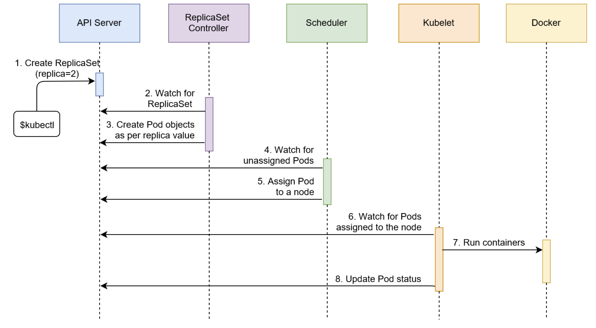
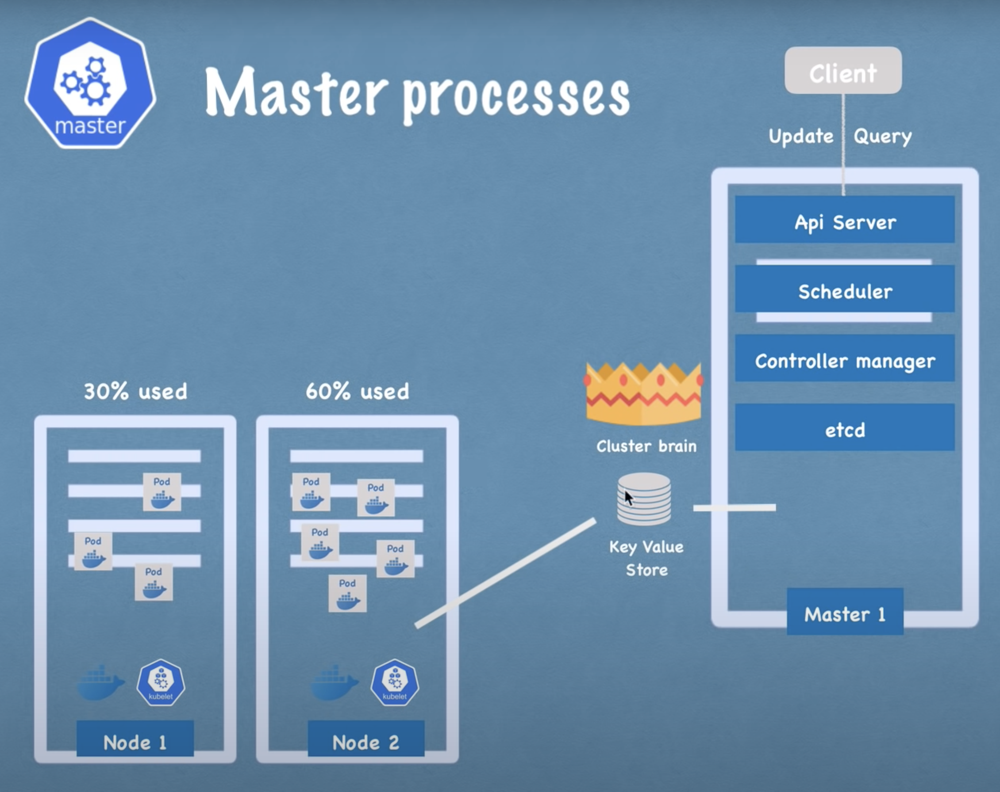
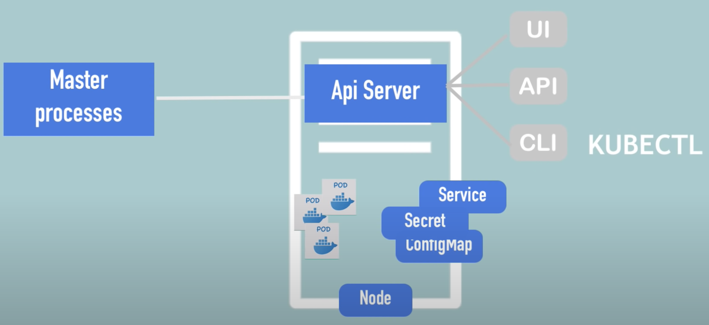

# Orchestration




* Compose file provides document, configure application’s dependencies (db, queues, caches, web API)
* Simple machine coordination → kubernetes for larger

> Example

* docker-compose
  * build: builds services in yml (skip if service is using prebuilt image)
    * --no-cache: Do not use cache when building the image
    * -f `file`: Specify an alternate compose `file` ([ex] **docker-compose.yml**)
    * -p `name`: Specify an alternate project `name` ([ex] **directory_name**)
    * --verbose: Show more output
  * config: show current docker-compose config
  * down: stop and remove resources
  * exec
    * db psql postgres postgres
  * help: display
  * images: lists images built using the current docker-compose file
  * version: check if installed
  * kill: Kill containers
  * logs `container`: prints all the logs created by `container` ([ex] **all_containers**)
    * -f: follow log output
    * -t: show timestamp
  * ps: lists all the containers for services mentioned in the current yml
  * run `service` `cmd`: create container from `service` in yml and run `cmd` ([ex] docker-compose run app sh)
    * --rm: Remove container after run
    * -v volume_name:/path: start container with volume
  * stop: stops running containers of specified services in yml file
  * top: Display the running

```sh
# 1. Redploy server
docker-compose -f up --build --force-recreate --no-deps -d

# 2. Set -f file
export COMPOSE_FILE=local.yml
```

> Error

* docker-compose cannot use gcloud credential helper on Linux
  * docker logout
  * docker login
  * gcloud auth activate-service-account --key-file=[키 파일]
  * gcloud auth configure-docker





* open-source platform developed by google
* High availability: designed to automate deploying, scaling, and operating application containers
* Disaster recovery: backup, restore
* Scalability: kubernetes Clusters to scale are registration and service discovery

> Terms

* Controller
  * reliability, scalability, LB
  * ReplicaSets, Deployment, DaemonSets, serivces

* DaemonSets: ensure that all nodes run a copy of specific pod


* Ingress: API object that manages external access to the services in a cluster, typically HTTP

* Labels: key / value pair that are attached to objects like pods services deployments
  * [ex[ release, stable, canary, dev, qa

* kubelet: Kubernetes node agent that runs on each node

* Kube-proxy
  * process that runs on all worker nodes
  * reflects services as defined on each node
  * Mode
    * user space
    * iptables
    * ipvs

* Namespace: allows teams to access resources with accountability
  * divide cluster resources between users
  * default namespace is created

* ReplicaSets
  * Ensure specific number of replics for a pod are running at all times

* Selectors
  * Used with kubectl
  * =, !=: equality-based
  * IN, NOTIN, EXISTS

* services: allow communication between one set of deployments with another
  * lifecycle of pod and service are not connected
  * Internal: permanent IP is only reachable within the cluster
  * External: to talk with pods in another deployments, endpoint available through node ip:port (called Nodeport)
  * Load balancer: Expose application to the internet with a LB
  1. Kubernetes client (kubectl) sent a request to API server requesting creation of Service
      * based on Pods created through go-demo-2 ReplicaSet
  1. Endpoint controller is watching the API server for new service events. It detected that there is a new Service object.
  1. Endpoint controller created endpoint objects with same name as Service, and it used Service selector to identify endpoints
      * in this case the IP and the port of go-demo-2 Pods
  1. kube-proxy is watching for service and endpoint objects
      * It detected that there is a new Service and a new endpoint object
  1. kube-proxy added iptables rules which capture traffic to the Service port and redirect it to endpoints
      * For each endpoint object, it adds iptables rule which selects a Pod.
  1. The kube-dns add-on is watching for Service. It detected that there is a new service.
  1. The kube-dns added db's record to the dns server (skydns).


* storage
  * shared resources by podsj




## Pods




* Pods: abstraction over container, simplest ephemaral unit that kubernetes can interact with
  * contains one or more docker container, storage resources, unique network ip, run options
  * usually single container in a pod
  * create, deploy, delete, represents one running process on your cluster (not necessarily made by Docker)
  * pending, running, succeeded, failed, CrashLoopBackoff
  * cannot be splited across nodes, they share the same set of resources, and can communicate with each other through localhost
  

* podspec: yaml file that describes a pod

* pod scheduling
  * API server: central component of a Kubernetes cluster running on the master node
    * in minikube both master and worker nodes are baked into the same virtual machine (can be different)
  * scheduler: watch for unassigned pods and assign to a node
    * with available CPU and memory matching Pod requirements running on master node
  * Kubelet: ensure assigned pods are running on the node running on each node
    * interacts with both container and node

  1. Kubernetes client(kubectl) sent request to API server requesting creation of a Pod defined in the pod/db.yml file
  1. Since the scheduler is watching the API server for new events, it detected that there is an unassigned Pod
  1. The scheduler decided which node to assign the Pod to and sent that information to the API server.
  1. Kubelet is also watching the API server. It detected that the Pod was assigned to the node it is running on.
  1. Kubelet sent a request to Docker requesting creation of containers that form the Pod
      * In our case, the Pod defines a single container based on the mongo image.
  1. Kubelet sent a request to the API server notifying it that the Pod was created successfully.

  




## Node

* Add new master / node server
  1. get new barse server
  1. install all master / worker node processes
  1. add it to the cluster

> Terms

* Master Node: Overall management of clusters
  1. API Server : front-end, gatekeeper for authentication
  1. Scheduler : creates pods, design pods to run on specific node
  1. Controller manager
      * node controller: detect changes in worker states
      * replication controller: maintain correct number of pods
      * end-point contoroller: join services, pods together
      * service account and token controller: access management
  1. etcd : cluster brain, detect changes in cluster, get availabilty of resources



* Node
  * requires: kubelet running, physical machine / container tools (docker), kube-proxy process running, supervisord (minikube)

## Yml

* **apiVersion**
* **kind**: so that Kubernetes knows what we want to do (create a Pod) and which API version to use
* metadata: provides information that does not influence how the Pod behaves
  * to define the name of the Pod (db) and a few labels
* spec: can have multiple containers defined as a Pod
  * .replicas. sets the desired number of replicas of the Pod (default 1)
  * .containers
    * name: [ex] db
    * image: [ex] mongo
    * command: command that should be executed when the container starts (mongod)
    * args: defined as an array with ([ex] [--rest, --httpinterface])

```yml
# 1. Replica set
apiVersion: apps/v1
kind: ReplicaSet
metadata:
  name: go-demo-2
spec:
  replicas: 2
  selector:
    matchLabels:
      type: backend
      service: go-demo-2
  template:
    metadata:
      labels:
        type: backend
        service: go-demo-2
        db: mongo
        language: go
    spec:
      containers:
      - name: db
        image: mongo:3.3
      - name: api
        image: vfarcic/go-demo-2
        env:
        - name: DB
          value: localhost
        livenessProbe:
          httpGet:
            path: /demo/hello
            port: 8080

# 2. Hello world
apiVersion: apps/v1
kind: Deployment
metadata:
  name: helloworld
spec:
  selector:
  matchLabels:
    app: helloworld
  replicas: 1 # tells deployment to run 1 pods matching the template
  template: # create pods using pod definition in this template
  metadata:
    labels:
    app: helloworld
  spec:
    containers:
    - name: helloworld
      image: karthequian/helloworld:latest
      ports:
      - containerPort: 80

# 3. cron job
apiVersion: batch/v1beta1
kind: CronJob
metadata:
  name: hello
spec:
  schedule: "*/1 * * * *"
  jobTemplate:
  spec:
    template:
    spec:
      containers:
      - name: hello
        image: busybox
        args:
        - /bin/sh
        - -c
        - date; echo "Hello, World!"
      restartPolicy: OnFailure
```

* create
  * Create a resource from a file or from stdin

```sh
cronjob cron --image=cron --schedule="*/5 * * * *" --dry-run=client -o yaml        # create yaml
-f yaml                # run yaml
```

* delete
  * all: all resource types such as pods, deployments, services
    * --all: delete every object of that resource type instead of specifying it using its name or label
    * -n `namespace`
  * pod: delete pods
  * nodes / pods / jobs name: delete node
  * namespace `namespace`

## Kompose

* conversion tool to go from Docker Compose to Kubernetes
* convert
  * -c: convert to helm chart

```sh
# Linux
curl -L https://github.com/kubernetes/kompose/releases/download/v1.22.0/kompose-linux-amd64 -o kompose
# macOS
curl -L https://github.com/kubernetes/kompose/releases/download/v1.22.0/kompose-darwin-amd64 -o kompose
chmod +x kompose
sudo mv ./kompose /usr/local/bin/kompose
```

## Helm

* Kubernetes package manager

* [github action helm](https://medium.com/intelligentmachines/github-actions-end-to-end-ci-cd-pipeline-for-django-5d48d6f00abf)
* a tool for managing Kubernetes packages called charts. Helm can do the following:
  * Create new charts from scratch
  * Package charts into chart archive (tgz) files
  * Interact with chart repositories where charts are stored
  * Install and uninstall charts into an existing Kubernetes cluster
  * Manage the release cycle of charts that have been installed with Helm

> Terms

* Chart: bundle of information necessary to create an instance of a Kubernetes application
  * push them to helm repository
* config: contains configuration information that can be merged into a packaged chart to create a releasable object
* release: a running instance of a chart, combined with a specific config

> Files

* Chart.yaml: A YAML file containing information about the chart
* values.yaml: The default configuration values for this chart
* values.schema.json: OPTIONAL: A JSON Schema for imposing a structure on the values.yaml file
* charts/: A directory containing any charts upon which this chart depends
* crds/: Custom Resource Definitions
* LICENSE: [optional] A plain text file containing the license for the chart
* README.md: [optional] A human-readable README file
* templates/: A directory of templates that, when combined with values, will generate valid Kubernetes manifest files
  * templates/NOTES.txt: [optional] A plain text file containing short usage notes

```yml
apiVersion: The chart API version (required)
name: The name of the chart (required)
version: A SemVer 2 version (required)
kubeVersion: A SemVer range of compatible Kubernetes versions (optional)
description: A single-sentence description of this project (optional)
type: The type of the chart (optional)
keywords:
  - A list of keywords about this project (optional)
home: The URL of this projects home page (optional)
sources:
  - A list of URLs to source code for this project (optional)
dependencies: # A list of the chart requirements (optional)
  - name: The name of the chart (nginx)
    version: The version of the chart ("1.2.3")
    repository: (optional) The repository URL ("https://example.com/charts") or alias ("@repo-name")
    condition: (optional) A yaml path that resolves to a boolean, used for enabling/disabling charts (e.g. subchart1.enabled)
    tags: # (optional)
      - Tags can be used to group charts for enabling/disabling together
    import-values: # (optional)
      - ImportValues holds mapping of source values to parent key to be imported
      - Each item can be string or pair of child/parent sublist items
    alias: (optional) Alias to be used for the chart. Useful when you have to add the same chart multiple times
maintainers: # (optional)
  - name: The maintainers name (required for each maintainer)
    email: The maintainers email (optional for each maintainer)
    url: A URL for the maintainer (optional for each maintainer)
icon: A URL to an SVG or PNG image to be used as an icon (optional).
appVersion: The version of the app that this contains (optional). Needn't be SemVer. Quotes recommended.
deprecated: Whether this chart is deprecated (optional, boolean)
annotations:
  example: A list of annotations keyed by name (optional).
```

* history `chartname`: show history
* install `chartname`
  * --values=my_values.yaml: value injection into template files
* package
* rollback `chartname` `number`: rollback to number
* search
* upgrade `chartname`

## Kubectl

* Kubernetes cluster manager



* api-resources
* apply
  * -f `url`

* cluster-info

* completion
  * echo 'source <(kubectl completion zsh)' >>~/.zshrc

* config
  * current-context: display current context (ex: minikube)
  * view: Show Merged kubeconfig settings
  * get-context: display list of contexts
  * unset `users.foo`: delete `user.foo`

* create: Create a resource from a file or from stdin
  * -f `helloworld.yaml`: creates a deployment resource from the `helloworld.yaml`
  * deployment `app_name`: deploy
    * nginx --image=nginx: start a single instance of nginx
  * secret cloudsql-oauth-credentials
    * --from-file=`path`: json `path`
    * --from-literal: [ex username=`db_username`, password=`password`]

* delete
  * svc `service`: delete `service`
  * pod `pod`: remove `pod`
  * -f `file.yml`: delete pod defined in `file.yml` (container get 30s for processes in those containers can shut down gracefully)
  * --cascade=false: prevent Kubernetes from removing all the downstream objects

* describe
  * svc `service`: describe `service`

* edit
  * deployment `name`

* exec
  * `db` ps aux: check status in pod `db`

* expose
  * deployment `helloworld`
    * --type=NodePort: exposes deployment outside of cluster
  * rs `helloworld`
    * --target-port=28017
    * --type=NodePort: If NodePort is used, ClusterIP will be created automatically

* get
  * all: Display one or many resources (pod is only accessible by its internal IP address within the cluster)
    * deployment: check if the deployment was created
    * --selector env=production
  * componentstatuses
  * nodes: verify minikube and virtualBox are talking each other (ex: minikube Ready 9d v1.19.4)
  * pods: show pods
    * --show-labels: Show labels for all pods
  * rs: show replica set
  * services: List all services in the namespace

* label
  * `pod` app=`label`: create new label
    * --overwrite
  * `app`-: delete `app` label

* port-forward
  * svc/app-service 8000:80

* rollout status deployment/nginx-deployment

* run `db`: create pod named `db`
  * --image `mongo`: run pod `mongo` (BAD)
  * --generator "run-pod/v1"

* service helloworld: open web browser to app that is running in Kubernetes

* version
  * --output=yaml

> Error

* The connection to the server 127.0.0.1:55001 was refused - did you specify the right host or port?
  * minikube start

## Minikube

* lightweight kubernetes implementation that creates a VM on local machine
* deploys a simple cluster containing only one node
* contains docker and localkube library and rkt


* brew install minikube

* apply: Apply a configuration to a resource by filename or stdin

* cluster-info
  * dump: detailed information about overall health of cluster

* dashboard
  * --url

* delete

* describe
  * `name`: ([ex] cronjob)

* docker-env: ([ex] export DOCKER_HOST="tcp://127.0.0.1:55003" ...)
  * eval $(minikube docker-env): every command we send to our local Docker client will be executed on the Minikube VM

* get
  * -o: output format (yaml)
  * all: see all nodes
  * --watch
  * cronjob / pods: list all cronjob
  * deployments / service: show all deployment / service

* ip

* logs
  * `pod` | TYPE/NAME: see logs inside `pod`

* start: sets up a Kubernetes dev environment for you via VirtualBox
  * --driver=docker
  * --vm-driver=virtualbox

* status: show minikube type

* ssh: go into ssh

* version
  * --client: client version

* service
  * `app`: access service through web (ex: helloworld)
  * list
