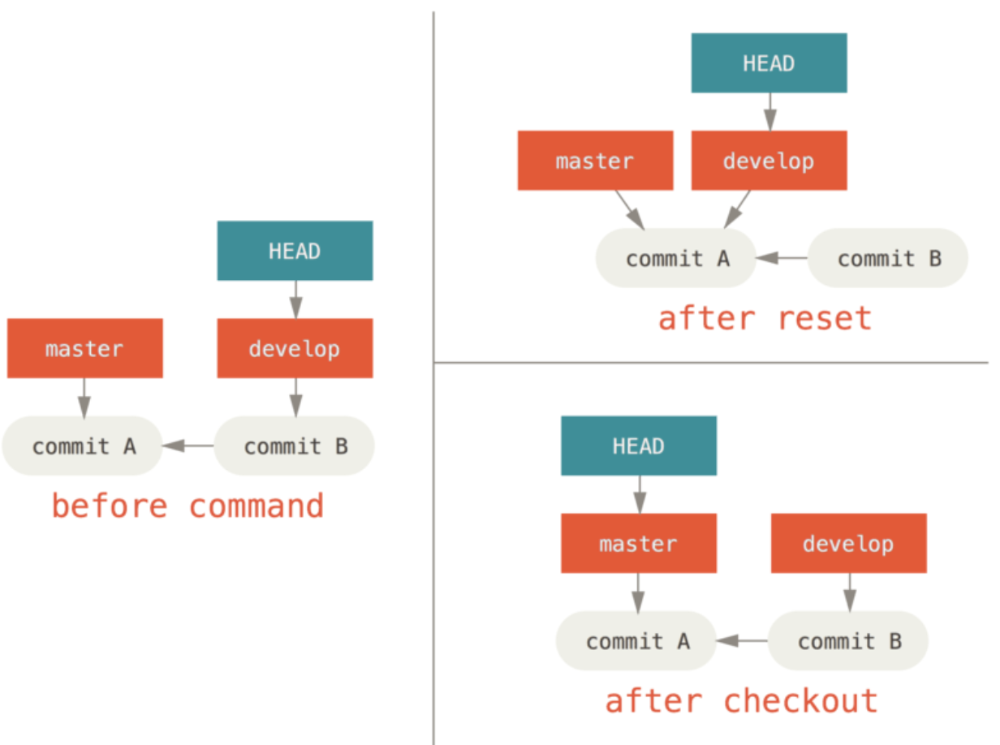
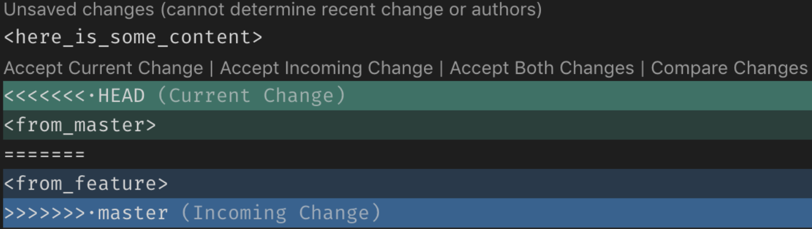
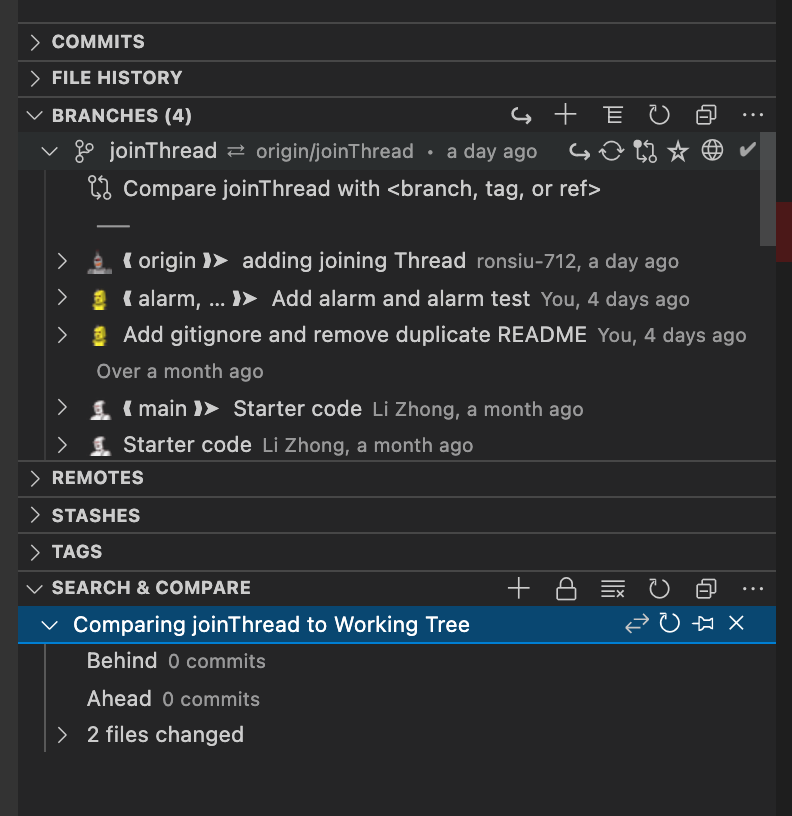

# Source control management


* uses sha-1 to compare hash

> Terms

* Bare repository: Repository without workspace
  * Can be used in a shared folder
* conflict
  * Option 1 ("Accept Incoming changes") would ignore completely what you had, and keep what you merge
  * Option 2 ("Accept current changes") would ignore completely what you merge, and keep what you had
* fast-forwarding: try to merge C1 with a C2 that can be reached by following commit history, just move pointer forward
* HEAD: pointer to the current branch
* index (staging area): where commits are prepared
* main (master before 2020.10): default name for the first branch in convention, this contains the local development

* stage: a cache of files that you want to commit
* origin: alias on your system for a particular remote repository
* workspace: where actual files are
* Merge: independent lines of development created by git branch and integrate them into a single branch
* Repository: container that tracks the changes to your project files
* squash: technique that helps you to take a series of commits and condense it to a few commits
* Issue: "fix \#33" commit messages closes issue




* npm install --save gatsby-source-git




* github
  * pip install PyGithub

```py
# 1. List all repository

from github import Github
g = Github("access_token") # using an access token

# Github Enterprise with custom hostname
g = Github(base_url="https://{hostname}/api/v3", login_or_token="access_token")

for repo in g.get_user().get_repos():
  print(repo.name)
```




## Message




* Uses present tense for commit message

> Example

* git commit
  * -t / --template: start the editor with the contents in given file ([ex] file)




> Error

* cannot lock ref 'refs/remotes/origin/working/sample': 'refs/remotes/origin/working' exists; cannot create 'refs/remotes/origin/working/sample'
  From [https://github.com/sample/repo](https://github.com/sample/repo)
  ! \[new branch\] working/hojae -&gt; origin/working/hojae \(unable to update local ref\)

  ```sh
  sean@ip-172-31-61-87:~/EnkorBackend$ git update-ref -d refs/remotes/origin/working
  git update-ref -d refs/remotes/origin/development
  ```

* fatal: refusing to merge unrelated histories
  * rebase instead
  * pull origin main --allow-unrelated-histories

* modified content, untracked content
  * git rm -rf --cached

## Hook

* prehook: static code checking (linting, codestyle)
  * exit non 0 doesn't get run
  * --no-verify         # make executable
* posthook only for notifying
  * chmod +x pre-commit
* Templates
  * .git/hooks directory
  * /usr/share/git-core/templates: Linux
  * C:\Program Files\Git\mingw64\share\git-core\templates: Window




```sh
#!/bin/bash
# https://gist.github.com/clbarnes/3b521f81b0f30f2db4df390dcd12ac8d

# cd [path-of-the-script]
# . install.sh
#
# Folders usecase
# /.git
# /.git/hooks
# /hooks/install.sh <- this script
# /hooks <- path of your hooks

set -e

# 1. list of hooks the script will look for
HOOK_NAMES="applypatch-msg pre-applypatch post-applypatch pre-commit prepare-commit-msg commit-msg post-commit \
pre-rebase post-checkout post-merge pre-receive update post-receive post-update pre-auto-gc"
PROJECT_ROOT_DIR=`git rev-parse --show-toplevel`

TGT_DIR=$PROJECT_ROOT_DIR/.git/hooks # absolute folder path of directory into which hooks should be installed
SRC_DIR=$PROJECT_ROOT_DIR/hooks      # absolute folder path of the custom hooks to deploy / current script
LNS_RELATIVE_PATH=../../hooks        # relative folder path from the target dir to the source dir

echo "Install project git hooks"

for hook in $HOOK_NAMES; do
  if [ -f $SRC_DIR/$hook ]; then     # if we have a custom hook to set
    echo "> Hook $hook"
    if [ ! -x $SRC_DIR/$hook ]; then
      echo " > Not executable, skipping"
      continue
    fi
    # If hook exists, executable, not a symlink
    if [ ! -h $TGT_DIR/$hook -a -x $TGT_DIR/$hook ]; then
      echo " > Old git hook $hook disabled"
      mv $TGT_DIR/$hook $TGT_DIR/$hook.old      # append .old to disable it
    fi

    echo " > Enable project git hook"           # create the symlink, overwriting the file if it exists
    ln -s -f $LNS_RELATIVE_PATH/$hook $TGT_DIR/$hook
  fi
done

# 2. Email Check
if ["$useremail" != "seanhwang@github.com" ]; then
  cat <<\EOF
ERROR: user.email not set to "seanhwangg@github.com"
EOF
  exit 1
fi
```




```sh
#!/bin/bash
# Store this file as .git/hooks/commit-msg in your repository in order to
# enforce checking for proper commit message format before actual commits. You
# may need to make the script executable by 'chmod +x .git/hooks/commit-msg'.
filename="$1"
copy=$(tempfile -p gitco)
cat $filename >> $copy
lineno=0

error() {
  echo  "CHECKIN STOPPED DUE TO INAPPROPRIATE LOG MESSAGE FORMATTING!"
  echo "$1!"
  echo ""
  echo "Original checkin message has been stored in '_gitmsg.saved.txt'"
  mv $copy '_gitmsg.saved.txt'
  exit 1
}

while read -r line; do
  # Ignore comment lines (don't count line number either)
  [[ "$line" =~ ^#.* ]] && continue

  let lineno+=1
  length=${#line}

  # Subject line tests
  if [[ $lineno -eq 1 ]]; then
  [[ $length -gt 60 ]] && error "Limit the subject line to 60 characters"
  [[ ! "$line" =~ ^[A-Z].*$ ]] && error "Capitalise the subject line"
  [[ "$line" == *. ]] && error "Do not end the subject line with a period"
  fi

  # Rules related to the commit message body
  [[ $lineno -eq 2 ]] && [[ -n $line ]] && error "Separate subject from body with a blank line"
  [[ $lineno -gt 1 ]] && [[ $length -gt 72 ]] && error "Wrap the body at 72 characters"
done < "$filename"
rm -f $copy
exit 0
```




```sh
if git rev-parse --verify HEAD >/dev/null 2>&1; then
  against=HEAD
else
  # Initial commit: diff against an empty tree object
  against=4b825dc642cb6eb9a060e54bf8d69288fbee4904
fi

# If you want to allow non-ASCII filenames set this variable to true.
allownonascii=$(git config --bool hooks.allownonascii)

# Redirect output to stderr.
exec 1>&2

# Cross platform projects tend to avoid non-ASCII filenames; prevent
# them from being added to the repository. We exploit the fact that the
# printable range starts at the space character and ends with tilde.
if [ "$allownonascii" != "true" ] &&
  # Note that the use of brackets around a tr range is ok here, (it's
  # even required, for portability to Solaris 10's /usr/bin/tr), since
  # the square bracket bytes happen to fall in the designated range.
  test $(git diff --cached --name-only --diff-filter=A -z $against |
    LC_ALL=C tr -d '[ -~]\0' | wc -c) != 0
then
  cat <<\EOF
Error: Attempt to add a non-ASCII file name.
This can cause problems if you want to work with people on other platforms.
To be portable it is advisable to rename the file.
If you know what you are doing you can disable this check using:
  git config hooks.allownonascii true
EOF
  exit 1
fi

# If there are whitespace errors, print the offending file names and fail.
exec git diff-index --check --cached $against --
```




## Precommit

* [Official Documentation](https://pre-commit.com/)
* [Combination of useful precommit](https://github.com/trussworks/pre-commit-hooks)

* Saves in ~/.cache/pre-commit

> Error

* missing imports
  * pip install pre-commit
  * For dynamic checking use repo: local and language: system

> Example

* pre-commit
  * install: Install at .git/hooks/pre-commit
  * --verbose
  * repo
    * local: hook must define id, name, language, entry, and files / types
  * language
    * system: shouldn't have additional_dependencies

* lerna
  * run
    * --concurrency 1
    * --stream precommit
    * --since HEAD
    * --exclude-dependents




* describes what repositories and hooks are installed

* default_stages: [ex] commit
* fail_fast: do not run if one fails
* repos
  * repo
  * hooks
    * id: [ex] custom-script-file
    * rev: Tag on github ([ex] v3.0)
    * entry: [ex] python3 script.py
    * always_run: [ex] **False**

```yml
- repos:
  - repo: https://github.com/pre-commit/mirrors-mypy
    rev: v0.812
    hooks:
    - id: mypy

  - repo: https://github.com/pre-commit/mirrors-pylint
    rev: "v3.0.0a3" # Use the sha / tag you want to point at
    hooks:
      - id: pylint
        additional_dependencies: [django, pylint-django]

  - repo: https://github.com/pre-commit/mirrors-yapf
    rev: ''  # Use the sha / tag you want to point at
    hooks:
      - id: yapf

  - repo: local
    hooks:
    - id: custom-script-file
      name: custom-script-file
      entry: relative/path/to/repo/root/check_pylint.sh
      language: script
      types: [python]
      pass_filenames: false
```

[](
  https://github.com/pre-commit/pre-commit)

* Powershell
  * Install-Module posh-git -Scope CurrentUser -Force
  * Import-Module posh-git
  * Add-PoshGitToProfile -AllHosts​​​​​​​

* git
  * -V / --version: Print git version
  * --no-pager: Print unicode
  * svn export <github_url>|trunk|codes: Download some files from github

* init: initialize git repository, create .git file

* config: Get and set repository or global options
  * --list: Print current configuration
  * --global: Change global config in ~/.gitconfig
    * alias.ac: [ex] "!git add -A && git commit -m"
  * --edit: Configure user name, email
  * core.editor `editor`: change default editor to vim ([ex] vim, nano)
  * --bool core.bare true: Create bare repository
  * credential.helper store: save id / pw in .gitcredentials
  * diff.submodule log: show changes in submodule
  * commit.template `template`: set git commit message ([ex] ~/.gitmessage)
  * credential.helper `option`: timeout password for month ([ex] 'cache --timeout=2628000')

```sh
# 1. accidentally removed .git
git init
git remote add origin <url>
git fetch
git reset origin/main

# 2. Create new repository
gh repo create  # (--public) or using web
git init
git branch -m main
git add -A
git commit -m "First commit"
git push --set-upstream origin main

# 1. Useful shortcuts
git config --global alias.ls "log --stat --color --decorate --all --oneline"
git config --global alias.lg "log --abbrev-commit --name-status --color --graph --pretty=format:'%Cred%h%Creset \
 -%C(yellow)%d%Creset %s %Cgreen(%cr) %C(bold blue)<%an>%Creset'"
git config --global alias.b "branch -vv"
git config --global alias.s "status"
git config --global alias.co "checkout"
git config --global alias.n "ls-files -o --exclude-standard"
git config --global alias.d "diff --stat"
git config --global branch.sort -committerdate
git config --global credential.helper cache  # Do not prompt password every time
git config --unset-all core.ignorecase && git config --system core.ignorecase false  # respect capitalization
```

## Files

> Example

* .git

  ```txt
  (venv) sean@Mac .git % tree -L 2
  .
  ├── COMMIT_EDITMSG
  ├── FETCH_HEAD
  ├── HEAD
  ├── ORIG_HEAD
  ├── REBASE_HEAD
  ├── config
  ├── description
  ├── hooks
  │   ├── applypatch-msg.sample
  │   ├── commit-msg.sample
  │   ├── fsmonitor-watchman.sample
  │   ├── post-update.sample
  │   ├── pre-applypatch.sample
  │   ├── pre-commit
  │   ├── pre-commit.sample
  │   ├── pre-merge-commit.sample
  │   ├── pre-push.sample
  │   ├── pre-rebase.sample
  │   ├── pre-receive.sample
  │   ├── prepare-commit-msg.sample
  │   ├── push-to-checkout.sample
  │   └── update.sample
  ├── index
  ├── info
  │   └── exclude
  ├── logs
  │   ├── HEAD
  │   └── refs
  ├── objects
  │   ├── 00
  │   ├── 01 ...
  │   └── pack
  ├── packed-refs
  └── refs
      ├── heads
      ├── remotes
      ├── stash
      └── tags
  ```

* .gitcredentials

  ```txt
  Username: sean
  Password: ss
  ```

* .gitattributes: Defining attributes per path

  ```txt
  \* text=auto
  ```

* .gitconfig

  ```txt
  [user]
    name = Gyuseung Hwang
    email = sean@remote.host
  [credential]
    helper = cache --timeout=360000        # timeout for password

  [alias]
    s = status -s
    co = checkout
    ci = commit
    br = branch
    lg = log --color --graph --pretty=format:'%Cred%h%Creset -%C(yellow)%d%Creset %s %Cgreen(%cr)%C(bold blue)<%an>%Creset'\
      --abbrev-commit
    backup = "!git branch backup-`git b0`"
    cleanbranch = "!git branch -d $(git branch --merged | grep -v '^\\*\\|\\<master$')"
    chs = !git checkout && git status
    acap = "!git add -A && git commit --amend && git push -f"
  ```

* .gitignore

  ```txt
  # .gitignore
  # git config --global core.excludesfile $HOME/.gitignore: Create global gitignore
  !*

  # *: Ignore everything
  # !*.py: But not these files...

  # For home file
  *

  !.ssh/**
  !*.vimrc
  !*.vim
  !*.bashrc
  !.gitignore
  ```




* sqliterc: put in home directory
  * .sqliterc







* .git
  * cat .git/HEAD: see head
  * rm -rf .git: Delete git repository




* .dockerignore
  * used to build better Docker images. avoid uploading unnecessary files reducing build time /image size




## Commit

> Term

* .gitmessage: default commit message

  ```txt
  Fix Issue #{number}: {description}
  R+: {reviewer}
  ```

> Example

* add
  * `filename`: add files to staging area
  * -A: Add, delete updated codes (git add . + git add -u)
  * -a: Adds only files that changed since the last commit before committing
  * -p: add some parts of files
    * y : stage, n : do not stage, q: do not stage remaining, g: select a hunk to go to
    * / : search for hunk to go, e: manualy edit current hunk, s: split current hunk into smaller
  * -u: Update or remove previously tracked files from the entire working tree

* apply: Apply a patch to files and/or to the index

* checkout: update HEAD to set the specified branch as the current branch
  * `branch`: switch to `branch`
  * `commit`: update HEAD to `commit`
  * `filename`: Discard changes in the working directory (enclose with ' to use wildcard '*.ext')
  * origin/master: check out remote
  * -b `branch`: create a `branch`, and use it (git branch -f branch [<start_point>] + git checkout branch)
  * -f branch commit: Reset `branch` to commit, even if branch exists
  

* checkout-index: Copy files from the index to the working tree

* cherry-pick: apply the changes introduced by some existing commits
  * C1 C2: copy C1, C2, … to our current HEAD
  * C1...C2: copy commit from C1 to C2 to our current HEAD
  * -n: cherry-pick each named commit to your working tree and the index, without making any commit

* clean: Remove untracked files from the working tree
  * -n: see what will be removed
  * -d: recurse directory
  * -f: force

* commit: move files in staging area to local repository
  * -a: automatically stage files that have been modified and deleted (add -u)
  * -m `msg`: given `msg` as the commit message
    * close, closes, closed, fix, fixes, fixed, resolve, resolves, resolved
  * --signoff: certifies who is the author of the commit
  * --amend: change previous commit message
  * --no-edit: Do not prompt change commit message
  * -t `tmp`: start commit with `tmp`

* mv
  * `src` `dest`: move `src` to `dest`
  * -t dest src1 scr2: move multiple item at once
  * -n: Do not overwrite an existing file

* rev-parse
  * --short HEAD: show current commit
  * --abbrev-ref HEAD: show current branch

* revlist: Lists commit objects in reverse chronological order

* revparse
  * --short HEAD: show first 7 strings

* rm `fn`: rm `fn` and add to stage area
  * --cached: only remove from the index
  * -r: remove recursively

* format-patch: Prepare patches for e-mail submission

* reset: Reset current HEAD to the specified state
  * `file`: Unstage a `file`
  * tree path: Unstage all changes in one file
  * HEAD `filename`: Discard all changes of `file` from previous commit
  * --hard `branch`: throws away all uncommitted changes to `branch`
  * -p: reset only chunk of file
  
  

* restore: Restore working tree files
  * .: restore all files in the current directory
  * -s `tree`: Restore the working tree files with the content from the given tree

* revert: forward-moving undo
  * branch: Creates new commit of existing commit
  * commit: Undo commits in a public branch
  

```sh
# 1. Accidentally removed .git
git init
git remote add origin <remote_address>.git
git pull
got reset --hard origin/main

# 2. Merge recent N commits
git reset --soft HEAD~N
git commit      # --edit

# 3. undo git commit --amend
git reset --soft HEAD@{1} && git commit -C HEAD@{1}
```




### Inspect




* blame `file`: show `file` history

* diff
  * -U n: allows you to customize the number of lines to show around a change
  * --stat: modified_file.txt    | 100 +-
  * --name-status: A / M / D  new_file.txt
  * --color-words: highlight words
  * HEAD:path/to/foo bar: diff over two commits


* diff-index: diff against the index or working tree / same as diff HEAD

* log: print recent logs
  * master: local commit history
  * master..: branch commit history
  * origin: server commit history
  * --all: Pretend as if all the refs in refs/ are listed on the command line as commit
  * --follow -- `file`: Show all commit that changed `file` even renames
  * --full-history -- `file`: show when was last deleted
  * -n: limit search to n
  * --reflog: show all commits
  * --oneline: show abbreviated version
  * --graph: In graph form
  * --author="sean": limit author
  * --grep = "init": search for message
  * -p `file`: show changes over time for a `file`
  * --since/until=2020-01-01: from time
  * -1 --stat -- `file`: Generate a diffstat (show file | 2 ++)
  * --pretty=oneline: line only

* ls-files: show all files
  * -o: only untracked files
  * --exclude-standard: ignore .gitignored files

* ls-tree
  * --name-only -r HEAD: List all files on the branch

* reflog: View all ref updates (checkout, reset, commit, merge)

* show: Show current and see what has been changed
  * all: show all lfs files
  * --shortstat: only show stat

* status: Show changes between commits, commit and working tree, etc
  * <>: changes between working directory and index
  * `HEAD`: all changes between working directory and `HEAD`
  * --cached: changes between index and HEAD | see added files
  * --name-only: name only
  * --porcelain: output in an easy-to-parse format for scripts
  * --staged: show changed between working directory and staged
  * --submodule: show lines in submodules

```sh
# 1. show certain files
git ls-files --stage ls-tree -r -t -l --full-name HEAD | sort -n -k 4 | tail -n 10 # Largest
git log --diff-filter=D --summary | grep images # show all deleted files

# 2. Diff snippets
python3 a.py | diff expected_out.txt - # Diff with pipeline
git diff --name-only --diff-filter=U    # show all unmerged files

# 3. log history in grpah
git log --graph --decorate --pretty=oneline --abbrev-commit --all : git lola
```




* git
  * Given featrue branch rebase from master
  

* gitlens
  * File diff
  
  * Branch diff
  




## Branch




* Ours / theirs mean the opposite of what they do during a straight merge
* branch: a lightweight movable pointer to one of these commits
  * ^(n): previous branch (nth parent)
  * ~n: n previous branch

> git CLI

* branch: show branch (starred branch is your current branch)
  * -vv: Show all the local branches of your rep
  * `branch`: create name `branch`
  * -d / -D `branch`: Delete merged `branch` / not merged in upstream branch
  * -f `b1` `b2`: Move `b1` to `b2`
  * -m A B: Rename branch (A to B)
  * -u `o/master` (`current_branch`): set branch to track `o/master`
  * -mc branch2: branch2 will be created


* filter-branch
  * --tree-filter: delete accidentally added file

* merge
  * `branch`: merge current branch with `branch`
  * --unset-upstream main: unset upstream branch
  * -s ours branch1 branch2 branchN: merge result is always that of the current branch HEAD
  * -X <ours/theirs>: ours favors the commits on the current branch


* mergetool
  * <>: run left

* rebase: pastes feature branch to the end of the master branch
  * `a` (`b`): `a` → current (`b` if specified)
  * -i: Interactive rebase
  * --root: from root
  * fetch && origin/master: Merge remote master to the local branc
  * -X: theirs favors the commits on the current branch ([ex] ours, theirs)

* switch: Switch to a specified branch
  * `branch`: switch to `branch`
  * -c `newbranch`: create `newbranch`

```sh
# 1. Merge result (ex: git config merge.conflictstyle diff3)
<<<<<<<
This is the branch that I have currently checked out (i.e. HEAD).
|||||||
The common ancestor version.
=======
Changes made on the branch that is being merged in. This is often a feature branch
.>>>>>>>

# 2. Remove one commit from git
git rebase --onto <commit-id>^ <commit-id> HEAD

# 3. Cleanup
git branch --merged | egrep -v "(^\*|master|main|dev)" | xargs git branch -d # delete merged branches
```




```js
// 1. Javascript
{
  resolve: 'gatsby-source-git',
  options: [
    {
      name: 'blog',
      branch: `deploy`,
      remote: `https://github.com/seanhwangg/blog.git`,
      patterns: '**/*',
    },
  ],
},
```




### Merge

* Mergetrain: queued list of merge requests, each waiting to be merged into the target branch




* merge train can run a maximum of twenty pipelines in parallel
* GitLab Runner 11.9 or later




## Remote




* git
  * push
    * `repo` `ref`: first push
    * -u every successfully pushed, add upstream
    * remote `local_br`:`remote_br`: (omit `remote_br` if identical)
    * origin `branch`: push only one specific `branch`
    * origin --delete `branch`: delete `branch`
    * -f origin `commit:banch`: ([ex] HEAD:master: push detached head)
    
  * remote: Find current repository
    * -r: List remote branches
    * -v: List all currently configured remotes
    * add `name` `url`: Adds a remote `name` for repository at `url` / add origin for new
    * rm origin: remove existing origin
    * get-url:
    * set-url `name` `new_url`: Changes URL remote points to

```sh
# 1. Undoing a push (revert is preferred)
git reset cc4b63b
git stash
git push -f origin alpha-0.3.0
git stash pop

# 2. Push new branch
git clone "repo_url"
# cd into files and edit File
git switch -c "branch_name"
git commit -am "commit msg"
git push --set-upstream origin "branch_name"

# 3. Make better_branch to main
git checkout better_branch
git merge --strategy=ours main  # keep the content of this branch, but record a merge
git switch main
git merge better_branch         # fast-forward master up to the merge

# 4. Remove files in only remote
git rm -r --cached .
git add .
```




### Fetch




* git
  * clone `url`
    * --bare: clone bare repository
    * `folder`: get a local copy of an existing repository (default cwd) (. for current directory)
    * --depth: [ex] 1: shallow clone
    * -b: clone branch
    * -j: number of submodules fetched at the same time ([ex] 5)
    * --recurse-submodules: initialize, update each submodule in repository
    * git://host.xz[:port]/path/to/repo.git/: does no authentication
    * ssh://[user@]host.xz[:port]/path/to/repo.git/
    * http[s]://host.xz[:port]/path/to/repo.git/
    * native transport (i.e. git:// URL) and should be used with caution on unsecured networks
    
  * fetch: downloads commits that remote has but missing from local repository and updates remote branches point
    * does not change anything about your local state
    * Before Fetch (left: Local, right: Remote with new bugFix)
    * --unshallow: fetch all older commits from shallow clone
    * --all && git reset --hard origin/master: Download from remote and discard all
    
    
  * pull
    * `repo` `ref`: fetch + merge
    * --allow-unrelated-histories: merge different git repository
    * origin `branch`: update local copy with commits in `branch` from remote repo
    * -C git-working-directory pull `git_remote`: pull in other directory
    
    
* gh repo
  * clone




## Tag




> git CLI

* checkout `version`: [ex] `v2.0.0`
* tag: See current tags
  * -a `version`: [ex] v1.4
  * -d `version`
  * -l `glob`: [ex] "v1.8.5*"
  * -m `comment`: [ex] "Fix Error"
* push
  * origin
    * --tags: push all local tags to remote
  * --delete origin `version`: deletes remote tag ([ex] push --delete origin 0.0.1)
* show `tag`: Show `tag`




## Lfs




* large file storage
* do not use large objects for faster cloning and fetching

> git lfs CLI

* --skip-smudge: ignore lfs when cloning
* track *.bin: Track all binary files
* install: setup lfs
* env: show env
* clone: Does not prompt for every large objects

> error: external filter 'git-lfs filter-process' failed

* lfs install --skip-smudge




## Stash


* git stash
  * pop ( -- filename): reapply all conflict (only filename)
  * show (-p): To show files changed in the last stash (content of the stashed files)
    * -p stash@{1}: Show specific stash
  * clear: clear stashed files
  * list: see lists of stashed files
  * git checkout stash -- .: overwrite current file
  * git checkout stash@{0} -- fn: stash pop certain files

## Submodule

> Term

* .gitmodules: config file that stores mapping between project’s URL and local subdir

  ```txt
  [submodule "DbConnector"]
    path = DbConnector
    url = https://github.com/chaconinc/DbConnector
  ```

> Example

* add
  * URL
  * path `https://github.com/pybind/pybind11`
* deinit
  * -f path/to/submodule Remove the submodule entry from .git/config
  * --all: delete all submodules
* init: initialize your local configuration file
* foreach: [ex] git push origin master: push each submodule
* summary: Show all submodules
* update: fetch all data from that project and check out appropriate commit
  * --init
  * --remote: go into your submodules and fetch and update

### Snippet




> Example

* gh gist
  * auth
    * login: authenticate user
  * gist
    * create `filename`: push `filename` to gist
    * list
    * ?file=afile: only one file in gist
  * pr
    * checkout `num`: checkout pullrequest number
    * list: show all pull request
      * --state closed: only see closed pull request
  * repo
    * create
      * --enable-issues=false
      * --public: change to public
  * ssh-key

```sh
# 1. share current directory
gh auth login
gh gist create *.sv
```







```py
import json
import subprocess as sp
import requests
import os
from itertools import islice
from math import ceil

def clone_all(username='seanhwangg', clone_path):
  current_count, total_count = 0, 1000
  git_cred = get_git_credential()

  for i in range(ceil(total_count / 100)):
    pid2popen = {}
    result = requests.get(f'https://api.github.com/users/{username}/gists?page={i}&per_page={100}', headers=git_cred)
    gists = json.loads(result.content)

    loop_count = min(total_count - current_count, len(gists))
    current_count += loop_count

    for g in islice(gists, loop_count):
      url, gist_path = f"https://gist.github.com/{g['id']}.git", f"{clone_path}/{g['id']}"
      if os.path.isdir(gist_path):
      p = sp.Popen(['git', '-C', gist_path, 'pull', url], stdout=sp.PIPE, stderr=sp.PIPE)
      else:
      p = sp.Popen(['git', 'clone', url, f"{clone_path}/{g['id']}"], stdout=sp.PIPE, stderr=sp.PIPE)
      pid2popen[gist_path] = p
    for gist_path, p in pid2popen.items():
      out, err = p.communicate()
      file2content = {}
      for file in os.listdir(gist_path):
        if not os.path.isdir(f"{gist_path}/{file}"):
          with open(f"{gist_path}/{file}", 'r') as f:
            file2content[file] = f.read().split('\n')
    return file2content
```



