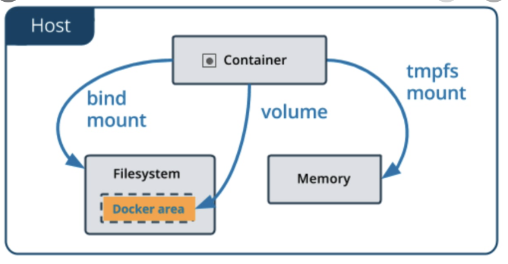

# Virtualization





* Carves up a computer into sealed containers that run your code
* Written in go managing kernels
* Sort multi-line arguments
* absolute minimum set up and configuration
* can be piped useful to perform one-off builds without writing a Dockerfile
* echo -e 'FROM busybox\nRUN echo "hello world"' | docker build -
* Reducing size of your final image
  * order them from the less frequently changed
  * instructions RUN, COPY, ADD create layers

> Terms

* Channel
  * Test channel: pre-releases that are ready for testing before general availability (GA)
  * Stable channel: latest releases for general availability (`year`.`month`)
  * Nightly channel: latest builds of work in progress for the next major release

* bridges: uses NAT and bridges to create virtual Ethernet networks
  

* image: every file that makes up just enough of the operating system to do what you need to do
  * Image ID is Internal docker representation of image

* kernel: uses cgroups to contain processes
  * uses namespaces to contain networks
  * copy-on-write filesystems to build images

* ns: allow processes to be attached to private network segments
  * private networks are bridged into shared network with rest of containers
  * containers haver virtual network cards
  * containers get their own copy of networking stack

* Repository: Where it came from

* registry: stores layers and images, listen on port 5000
  * maintains index and searches tags, authorize authentication

* route

* socket: By default, a unix domain socket (or IPC socket) is created at /var/run/docker.sock
  * requiring either root permission, or docker group membership

* Stroage
  * Block: Fixed size of data, no metadata is stored, I/O intensive apps, store persistent application data
  * Object: metadata + unique identifier, scalability is limitless, accessed with HTTP calls, store images (aws S3)

* Storage driver: control how images, container are stored in docker host (overlay2)

* tag: maybe empty → better to refer it by IMAGE ID
  * Version number

* Hypervisor: Hyperkit(OSX) / hyper-V (Win) (direct link to infrastructure)
  * VirtualBox / VMWare (run on host OS)

```sh
# 1. bridge
apt-get update && apt-get install bridge-utils
docker run -ti --rm -v --net=host ubuntu:16.04 bash
docker network create new  # add one more to list

### terminal
apt update && apt install brid install bridge-utils
brctl list

# 2. Route
docker run -ti --rm --net=host --privileged=true ubuntu bash
docker run -ti -p 8080:8080 ubuntu bash  # will add port forwarding in iptables

### in docker 1
apt-get update && apt-get install iptables
iptables -n -L -t nat

cat /proc/self/cgroup | head -1 | tr --delete ‘10:memory:/docker/’  # Get full docker inside container
```

> Example

* Dockerfile: small program to create an image
  * Each line takes image from previous and make another image → append changes at the end
  * process you start on one line will not be running next line → use ENV

  * ADD: Copy file, if compressed, decompress automatically (depends on OS)
    * `local_path` `docker_path`: copy local_path to docker_path
    * If file is from URL, use permission 600 and doesn’t decompress
    * root:root by default
    * project.com/download/1.0/project.rpm: project

  * ARG `name`[=[default value]]: defines a variable that users can pass at build-time to the builder (--build-arg [varname]=[value])

  * CMD ["executable","param1","param2"] (exec) / command param1 param2 (shell)
    * provide defaults for an executing container
    * run once when container has started, using docker run     # can override using run IMG CMD
    * does not execute anything at build time, but specifies the intended command for the image
    * Must be used once, if multiple used last

  * COPY `src`... `dest`: copies files or directories from `src`, adds them to filesystem of container at path `dest`
    * may contain wildcards and matching will be done using Go’s filepath.Match rules
    * Doesn’t change file permission
    * --chown=`user`:`group`

    ```sh
    # Simple web server
    FROM httpd:2.4
    COPY "$PWD" /usr/local/apache2/htdocs/
    # With Dockerfile
    # docker build --pull --rm -f "Dockerfile" -t image_name:latest "." && \
    # docker run --rm -it -p 8080:80 --name container_name image_name:latest bash

    # index.html
    <h1>Run in docker</h1>
    ```

  * **FROM**: to specify our base image
    * `image`: set base image

    ```sh
    # Multistage Dockerfile
    FROM ubuntu:16.04 as builder
    RUN apt-get update
    RUN apt-get -y install curl
    RUN curl https://google.com | wc -c > google_size

    FROM alpine
    COPY --from=builder /google_size /google_size
    ENTRYPOINT echo google is this big; cat google_size

    docker build -t google_size .
    docker images                 # google_size is only 5.57MB
    ```

  * MAINTAINER: specifies the owner of the image
  * ENTRYPOINT: allows you to configure a container that will run as an executable
    * cmd param1 param2
    * start of the commands to run (arguments CAN NOT be over-ridden)
    * ENTRYPOINT will be started as a subcommand of /bin/sh -c, which does not pass signals
    * Only the last ENTRYPOINT instruction in the Dockerfile will have an effect

  * LABEL: adds metadata to an image

  * RUN `executable` `params...` (exec) / command param1 .. (shell) ([ex] /bin/sh -c on Linux or cmd /S /C)
    * execute in a new layer on image and commit results → used for the next step in the Dockerfile
    * parsed as JSON, which means that you must use double-quotes + escape backslashes
    * cache for RUN instructions can be invalidated by docker build --no-cache

    ```sh
    # Install sudo Dockerfile
    FROM ubuntu:latest
    RUN apt-get update && apt-get -y install sudo
    RUN useradd -m docker && echo "docker:docker" | chpasswd && adduser docker sudo
    USER docker
    ```

  * USER
    * `user`: set user (default root)

  * workdir
    * cd before all other command

* docker-compose.yml: manage multiple Dockerfile
  * version: specification for backward compatibility but is only informative (ex: "3.6")
  * deploy (/services/sid/deploy)
    * mode: replicated (default), global
    * labels: com.example.description: "description"
    * replicas: replicas specifies # containers that SHOULD be running at any given time
    * resources: physical constraints for container to run on platform (limits, reservations)
    * preferences:: platform's node SHOULD fulfill, datacenter: us-east
    * restart_policy: condition, delay
  * build (/services/sid/build)
    * context: path to a directory containing a Dockerfile or url to a git repository
    * dockerfile: alternative dockerfile webapp.Dockerfile
    * args: can be omitted, build arg won't be set if not set by command building image
    * labels: add metadata to the resulting image
    * shm_size: size of the shared memory (/dev/shm)
    * target: defines the stage to build as defined inside a multi-stage
  * logs
  * working_dir: /code
  * ps

* docker-machine: when your Host OS does not support running Docker Engine natively
  * env-default
  * env: Get environment variable
  * ip default: Get default IP
  * start
  * create
  * restart

> Error

* Input device is not a TTY
  * remove -it option in docker run

* Error response from daemon: removal of container `containerid` is already in progress
  * restart docker

* "-v": executable file not found in $PATH: unknown
  * image argument must come last (-v page:page image:latest)
  * docker run -ti image:latest bash -v page:page

* Hang when apt [Connecting to archive.ubuntu.com (91.189.88.142)]
  * use apt-get update

* docker: Error response from daemon: driver failed programming external connectivity on endpoint
  app_2 (d408c39433627b00183bb): Bind for 0.0.0.0:80 failed: port is already allocated.
  * A port can be assigned to only one container/process at a time

  ```sh
  docker run -d -p 80:3000 --name app_1 app
  # 06fbad4394aefeb45ad2fda6007b0cdb1caf15856a2c800fb9c002dba7304896
  docker run -d -p 80:3000 --name app_2 app
  # d5e3959defa0d4571de304d6b09498567da8a6a38ac6247adb96911a302172c8
  ```

* Cannot download images: Error response from daemon: unauthorized: authentication requried
  * docker login (registry)

* ERROR COPY `book` /note/book not found
  * check if `book` is in gitignore




## Image




> Example

* docker
  * commit
    * `container`  IMAGE:TAG: convert `container` to images return image_id
    * -m "commit messages"

  * history `image`: show history of `image`
    * -h: human readable format

  * images: Display all docker images
    * a: See all container (including stopped container)
    * l: Last container to exit
    * prune -f: remove unused images

    ```sh
    docker images -a | grep "pattern" | awk '{print $3}' | xargs docker rmi   # images with mattern
    ```

  * rmi
    * `image`: remove `image`
    * -f: Force remove

    ```sh
    docker rmi -f $(docker images -a -q) # all images
    docker rmi $(docker images -f "dangling=true" -q)  # remove all dangling images
    ```




## Volume






* recommended way to persist data, `/var/lib/docker/volumnes/`
  *:z: Shared across container
  *:Z: Private

> Example

* Dockerfile
  * VOLUME: avoid defining shared folders in Dockerfiles

* docker volume
  * ls: see all available volumes
  * inspect vid: inspect more about volume id
  * create name: create volume `name`
  * rm name: create volume `name`
  * prune: remove all unused volume

  ```sh
  docker run -dit --name container_name -p 8080:80 -v "$PWD":/usr/local/apache2/htdocs/ httpd:2.4 && \
  docker exec -it container_name bash
  ```

* docker-compose volume
  * type: [ex] volume
  * source
  * target
  * volume

  ```sh
  # 1. Communicate
  ### Terminal 1
  docker run --rm -ti --net learning --name catserver ubuntu:14.04 bash
  nc -lp 1234
  ping dogserver

  #### Terminal 2
  docker run --rm -ti --net learning --name dogserver ubuntu:14.04 bash
  nc catserver 1234

  # 2. Logs
  docker run --name log -d ubuntu bash -c "lose /etc/password"
  docker logs log   # bash: lose: command not found
  ```

* docker-compose.yaml

  ```yml
  ports: # Volumes
    - "3000" /  "3000-3005" /  "8000:8000" / "9090-9091:8080-8081"
    - "127.0.0.1:8001:8001" / "127.0.0.1:5000-5010:5000-5010" / "6060:6060/udp"

  services: # Volume
    backend:
    image: awesome/database
    volumes:
      - db-data:/etc/data
    backup:
    image: backup-service
    volumes:
      - db-data:/var/lib/backup/data

  volumes:
    db-data:
  ```

  * local

    ```yml
    version: '3' # For django production

    volumes:
      local_postgres_data: {}
      local_postgres_data_backups: {}

    services:
      django:
        build:
          context: .
          dockerfile: ./compose/local/django/Dockerfile
        image: classroom_local_django
        container_name: django
        depends_on:
          - postgres
        volumes:
          - .:/app:z
        env_file:
          - ./.envs/.local/.django
          - ./.envs/.local/.postgres
        ports:
          - "8000:8000"
        command: /start

      postgres:
        build:
          context: .
          dockerfile: ./compose/production/postgres/Dockerfile
        image: classroom_production_postgres
        container_name: postgres
        volumes:
          - local_postgres_data:/var/lib/postgresql/data:Z
          - local_postgres_data_backups:/backups:z
        env_file:
          - ./.envs/.local/.postgres

      docs:
        image: classroom_local_docs
        container_name: docs
        build:
          context: .
          dockerfile: ./compose/local/docs/Dockerfile
        env_file:
          - ./.envs/.local/.django
        volumes:
          - ./docs:/docs:z
          - ./config:/app/config:z
          - ./classroom:/app/classroom:z
        ports:
          - "7000:7000"
        command: /start-docs
    ```

  * deploy.yml

    ```yml
    version: '3' # 2. deploy.yml for django deploy

    volumes:
      production_postgres_data: {}
      production_postgres_data_backups: {}
      production_traefik: {}

    services:
      django:
        build:
          context: .
          dockerfile: ./compose/production/django/Dockerfile
        image: classroom_production_django
        depends_on:
          - postgres
          - redis
        env_file:
          - ./.envs/.production/.django
          - ./.envs/.production/.postgres
        command: /start

      postgres:
        build:
          context: .
          dockerfile: ./compose/production/postgres/Dockerfile
        image: classroom_production_postgres
        volumes:
          - production_postgres_data:/var/lib/postgresql/data:Z
          - production_postgres_data_backups:/backups:z
        env_file:
          - ./.envs/.production/.postgres

      traefik:
        build:
          context: .
          dockerfile: ./compose/production/traefik/Dockerfile
        image: classroom_production_traefik
        depends_on:
          - django
        volumes:
          - production_traefik:/etc/traefik/acme:z
        ports:
          - "0.0.0.0:80:80"
          - "0.0.0.0:443:443"

      redis:
        image: redis:5.0

      awscli:
        build:
          context: .
          dockerfile: ./compose/production/aws/Dockerfile
        env_file:
          - ./.envs/.production/.django
        volumes:
          - production_postgres_data_backups:/backups:z
    ```

## Container




* Stateless, Self-contained sealed unit of software → contains everything required to run the code
* code / configs / process / network / dependencies / operating system
* dependent on images and use them to construct a run-time environment and run an application
* contents of layers are moved between containers in gzip files
* [-] filesystem isn't designed for high I/O
* [-] ephemaral: exit when process that started it exits (have its own IP address)

> Example

* docker
  * attach
    * `cont`: links a local input, output, and error stream to a `cont`

  * cp: copy from / to container
    * */: copy direcrtory
    * `foo.txt` `mycontainer:/foo.txt`: One file can be copied TO the container
    * `mycontainer:/foo.txt` `foo.txt`: One file can be copied FROM the container

  * logs
    * `cont`: show output of the `cont`
    * --since: [ex] 10s

  * rm: Remove one or more containers
    * `container`: remove `container`
    * -f: Force remove

    ```sh
    docker rm -vf $(docker ps -a -q)     # all containser
    ```

  * run: Run a command in a new container, downloads from default registry if doesn't exists
    * `image` `cmd`: Start an empty new container (latest by default)
    * -d: Run in detached mode
    * -e `HOME=/home`: set environment `Home` to `/home` variable
    * -ti: Terminal interactive
    * --rm: Delete container after exit
    * --name `container`: set `container`
    * --link cont: can see env of container 'aaa'
    * --restart `policy`: [ex] **no**, always, unless-stopped
    * -p `[url:]host:cont[/type]`: [ex] 127.0.0.1:80:8080[/type]
    * -v / --volume `host`:`cont`: Mount directory within docker, if file exists ([ex] /your/dir:/var/lib/mysql)
      * :z: Docker that the volume content will be shared between containers
      * :Z: Docker to label the content with a private unshared label
    * -w `dir`: make your working directory inside docker be `dir`
    * --memory: Limit memory
    * --cpu-quota: limit cpu

    ```sh
    --privileged=true --pid=host     # can kill other docker
    -ti ubuntu bash -c "cat /etc/lsb-release"            # show ubuntu version
    --name mongo-db -v /data:/data/db -p 27017:27017     # mongodb
    -p 8080:8080 -p 50000:50000 jenkins/jenkins          # bind named volume # slave communication
    --rm -v /var/run/docker.sock:/var/run/docker.sock docker sh    # docker in docker
    --publish 8080:8080 -v jenkins_home:/var/jenkins_home --name jenkins jenkins/jenkins:lts
    ```

  * start
    * `cont`: start `cont`
    * -a: attach STDOUT / STDERR and forward signals
    * -i: attach container’s STDIN

  * service: used when configured master node with Docker swarm so that containers will run in distributed, managed environment
    * ls: list all services
    * ps: see detailed service
    * create: create new service
      * --netowrk
      * --name
      * --replicas=`n`

  * stop
    * `cont`: stop `cont`

  * ps: display all running container
    * -a: Show all containers
    * -q: Only display numeric IDs
    * -s: Display total file sizes
    * -l / -n -1: Show the latest (n last) created container
    * --no-trunc: Don’t truncate output

    ```sh
    # Custom format Format
    --format $FORMAT
    export FORMAT="\nID\t{{.ID}}\nIMAGE\t{{.Image}}\nCOMMAND\t{{.Command}}\nCREATED\t{{.RunningFor}}\nSTATUS\t{{.Status}}\nPORTS\t{{.Ports}}\nNAMES\t{{.Names}}\n"
    docker ps -q | xargs docker inspect --format='{{ .State.Pid }}' | xargs -IZ sudo fstrim /proc/Z/root/
    ```

  * stats: live stream of container(s) resource usage statistics
    * top: ps
    * -a: show only running
    * --no-stream: show once

* docker-compose
  * up: Create and start containers (build + run)
    * -d: Run containers in the background, print new container names
    * --force-recreate: Recreate containers even if their configuration and image haven't changed
    * --build: Build images before starting containers
    * --scale `service`=`n`: Scale `service` to `n`
    * --service-ports django: enable pdb inside docker

* docker-compose.yaml
  * services (/services): set list of services with following fields
    * blkio_config: defines a set of configuration options to set block IO limits for this service
    * build
      * context: either a path to a directory containing a Dockerfile, or a url to a git repository
      * dockerfile: set Dockerfile-alternate relative to context
    * dns: defines custom DNS servers
    * command: overrides default command declared by the container image (CMD)
    * context: Either a path to a directory containing a Dockerfile, or a url to a git repository
    * cpu_count: number of usable CPUs for service container
    * cpu_shares: service container relative int CPU weight versus other containers
    * cpu_period: allow Compose impl to configure CPU CFS period when platform is based on Linux kernel
    * cpu_quota: allow Compose impl to configure CPU CFS quota when platform is based on Linux kernel
    * cpu_percent: usable percentage of the available CPUs
    * mac_address:
    * image: set default image (node:lts)
    * entrypoint: overrides default entrypoint for the Docker
    * working_dir: Specify working directory

> Error

* Couldn't connect to Docker daemon at http+unix://var/run/docker.sock - is it running?
  If it's at a non-standard location, specify the URL with the DOCKER_HOST environment variable.
  * sudo usermod -aG docker $USER
  * su $USER






## Docker CLI

* docker
  

  * build
    * `docker_dir`: build folder with Dockerfile
    * --rm: Remove intermediate containers after a successful build
    * --pull: Always attempt to pull a newer version of the image
    * -t `tag` .: tag name to
    * -f `file`: name of the Dockerfile

  * events: get real-time events from the server

  * prune -f

  * detach
    * ctrl + p, ctrl + q → detach and continue running

  * diff: see changes from created image

  * exec: starts another process in an existing container → good for debugging and DB administration / can't add ports, volumns
    * -it: interactive mode
    * jenkins cat /var/jenkins_home/secrets/initialAdminPassword: Get password

  * kill: `container`: change to stop state
    * -s `signal`: send signal

  * load

  * save
    * -o my-images.tar.gz debian:sid busybox ubuntu:14.04

  * secret
    * ls: list all secrets
    * rm: rm
    * create name file|item: create secret

  * tag
    * `image` `new_id`: Change `image` to `new_id`
    * image_id docker_id/alpine:tag1: tag images (seanhwangg.io/page connect to remote)

  * inspect
    * `image`: show image nformation
    * `container`: container information
    * volume: Show volume information
    * --format
      * '{{range .NetworkSettings.Networks}}{{.IPAddress}}{{end}}'     # '{{.State.Pid}}'

  * system
    * df: information regarding amount of disk space used by docker daemon
    * prune: remove stopped, volumes unused by container, dangling image
    * ls

    ```sh
    prune -a --volumes     # unused containers, volumes, networks and images
    ```

  * top: Display the running processes of a container

  * version: Show the Docker version information

  * login
    * -u `user`
    * -p `pw`

  * logout

  * pull
    * `HOSTNAME/PROJECT-ID/IMAGE:TAG`: Pull image or a repository from a registry (jenkins /ubuntu)

  * push: Push an image or a repository to a registry
    * `repository/image[:tag]`: push `image` to docker `repository`

  * search `image`: Search Docker Hub for `image`
